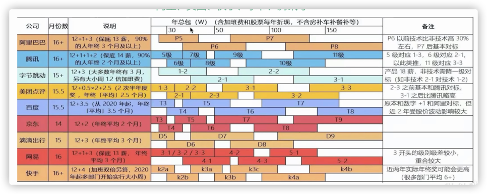
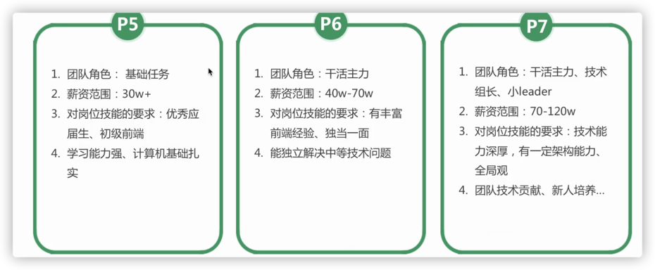
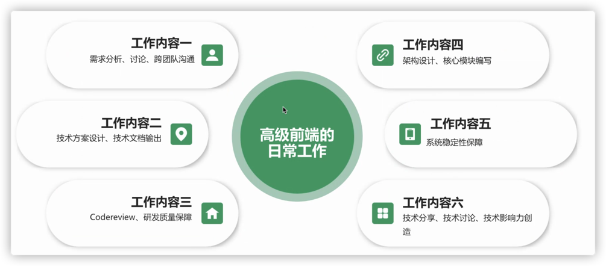
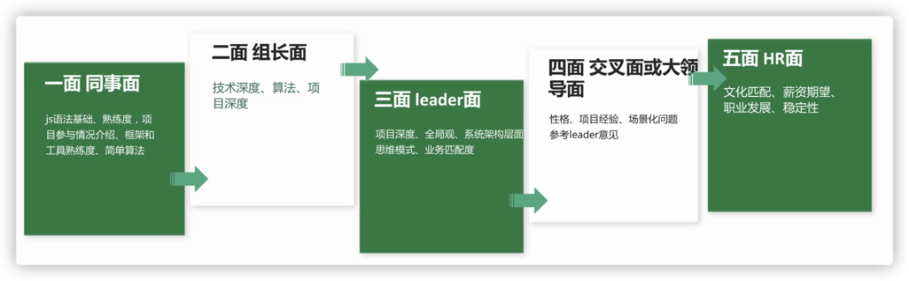

### 周五 todo

- meta+lyric
- 状态数据明确 ✅
- 后台管理固定套路 ✅
  - 函数命名
  - 与接口结合
- 快速选择时间 ✅
- 人员管理模块


---

### 状态

- 歌词歌曲列表接口返回的 status === meta 歌曲列表返回的 status ？  

---

### 后台管理固定套路 > 与接口结合

- 定义 request 
- 定义 response

---

### 如何借助 ts 的报错信息，重构代码？

- 初期使用这个 interface 

  

- 在重构的阶段，想删除这个 SongItem interface ，直接删除，目前控制台不会报错，期待报错，那么我根据控制台报错，解决所有报错，即完成重构。

- 

---

### 人员管理模块实现

- 使用 postman 获取用户数据


## 2022.07.03

### 开始思考，约课这个应用的实现


## 2022.07.04 周一

todo

- google 导数据
- 人员管理api 实现
- 看打标文档
- andy 优化

---

### 人员管理api 实现

- 分为两个部分：
  - 如何获取调用的 token？（和调用微信提供的 SDK 一致）
  - 权限如何设计？（后台管理通用需求）
- 权限系统三要素
  - 账号users => 张三
  - 角色role => 高级销售
  - 权限permission =>1. 分配订单 2. 招聘初， 低销售
- 人员管理，需要达到的功能
  - 查看某个 role 的所有人员列表
  - 将用户分配给角色


---

### 看打标文档

- 可以打 1 个 or 多个标签

- 可以删除已经打的标签

  、

  

  

---


## 2022.07.05 周二 

todo

- 打标管理模块 1/2 ✅
- 自评 ✅
- andy ❌


---

### 打标管理

- apifox 响应结果，如何保证 response.result 为 ok or error 两者选一？

  

- 

---

## 2022.07.06 周三

todo

- 完结打标功能， modal 组件生成标签树 + 用户操作生成打标数据

- andy 三个问题

  如何判断是否做了 meta ？

- readme

---


### 完结打标问题

- taskDoList 页面 table 获取歌曲打标数据 /ms-map-seed-server/song-tag/page 》 tagTypeMap 
- taskDoList 页面获取树结构
- 选择

---

### andy 

- table F 列明明是空的，按正常应该需要制作 meta，但是现在却显示不需要制作 

  - 需要有方法判断youtubeId是否已经制作 meta 完成

  - 如果没做 meta ，直接做了歌词，并且分发，流程能走通吗？verstion 是不是会显示只有一个 version，且是他自己？没有 system？
  - version editor 为 system 的是什么情况？

- ~~为什么已经做过的歌词任务，在增量表格依然存在？~~

- ~~已经做过的歌词任务，重新打开，显示还没有歌词？~~

- http://localhost:3001/historyVersion?vid=dN-ZK8r8XhI 这个歌曲历史记录为什么有问题

- 

---

## 20220.07.07 周四

todo 

- 完结歌曲打标模块
- google 调用打标接口
- 上线生产环境
- mana 反馈问题

---

### 完结歌曲打标模块

- 代码优化需求

  - 如何删除所有 console.log

  - 如何删除所有 import 未使用变量

    

  - 如何删除多余的行
  - 如何传递 get id=[1,2,3]数据


---

### google 调用打标接口

- 通过staging接口进行测试是否打标成功
- 调用这个接口/ms-map-seed-server/song-tag/marking-by-name
- 打标接口需要如下参数
  - 达标人
  - 根据 AL 列确定能否调用
  - 根据 V~AF 列生成 body 请求参数
  - 新增 AQ 列
- 错误

---

## 2022.07.08 周五

todo

- mana meta 修改
- 后台上线 结合人员管理
- 后台打标操作


---

### mana meta 修改

- taskDoList  modal 输入 spotify ，不会回填

- taskDoList 输入 spotifyId ，回填数据错误

- 坑

  终于发现通过 split 获取字符串的数据可能存在的 bug

  现有 string = "youtube-abc"，需要截取 abc , 一般使用 string.split('-')[1], 但是这样有问题

  string = 'youtube-abc-1'，应该截取的是 abc-1， 但是会截成 abc

---

### 后台上线 结合人员管理

如何生成 menu + 权限？


----

## 2022.07.09 周六

todo

- 上线歌词制作 + meta 匹配生产环境
- 联调打标


---

## 2022.07.10  周日

todo

- 区分staging | prod
  - const.ts 文件，process.env.NODE_ENV 错误
- 测试歌词全部流程


---

## 2022.07.11  周一

todo

- 测试 lyric 流程
- tag 流程
- staging 后台管理跳转到歌词制作工具 prod 的问题
- 有没有工具测试整个流程？
- git 工作流程
- 重构整个代码，解决错误
- 导google数据
- 处理 andy 问题
-  背景 + 歌曲打标数据
- 后台管理 + lyric 制作生产 + 测试环境区分
- 包


---

### 测试 lyric 流程

- 【50 分钟】当任务被审核拒绝后，歌曲的状态为 status === null，auditStatus === AUDIT_REJECT

  


---

### tag 流程

- 【20 分钟，没做完】table 添加 tag 展示
- 【40 分钟】添加 tag、lyric、meta song auditSuggestion

----

### 导google数据

- 【40 分钟】
- 这些数据有问题，需要问下 shiwei https://docs.google.com/spreadsheets/d/1tWQPvGGwh_kXCHqjrcSCbfatmhBunURN_OyDkpHBgZQ/edit#gid=1346116631&fvid=510107456 这些数据 显示 lyric make unfinished. 但是我已经做了歌词修改


---

### 处理 andy 问题

- 【14：14 ~ 15：47】

- 问题 1

  如果一首歌曲没有 lyric ，应该如何写歌词？ 问 mana

- 问题 2

  一首歌有三个版本，但是在freelancer 电脑显示第二个版本，期待显示第三个版本

- 问题 3

  - 歌词制作工具，需要加上 mark as done 按钮，表示这首歌曲制作完成
  - 封装 axois ，最好能保证复制 apifox 等工具的路径即可，不需要额外的前缀
  - 【数据管理框架】假设数据为 {a: number, b: string}，需要支持set 数据为 {a: 1}，b 依然保持原数据
  - 重要： 需要测试歌词制作工具是否区分了环境


---


### 背景 + 歌曲打标数据

- 【15：50 ~ 20:35】

- 处理材料

  - 只需要0607-素材打标 https://docs.google.com/spreadsheets/d/1MiJIpPorxmKz5k0MN4631zAPaTxMY2YPbkpZrzhn9P0/edit#gid=1527148578

  - Q2 歌曲https://docs.google.com/spreadsheets/d/1bs637a8DpDD2zYwNQbNUoX9AKcPVOooBDHIRBASQldU/edit#gid=1975850536

    https://docs.google.com/spreadsheets/d/1bs637a8DpDD2zYwNQbNUoX9AKcPVOooBDHIRBASQldU/edit#gid=1975850536&fvid=1664951814  这些是存在问题的数据

    {"result":"error","data":{"result":"error","message":"tag name nonentity, nonentity names:[other]","data":null,"traceId":null}}

  - Q3 所有表格

- 寻找入口，切入点
- staging 先测试，没有问题再切换环境 prod，所以一个项目，一定要有生产和测试环境
- 永远考虑到用户的特殊操作，不然由于用户的特殊操作，会导致数据库数据不符合需求，导致浪费大量数据处理数据
- 【逻辑判断】判断 input 不为 y or Y ，竟然是 value !== "y" &&  value !== "Y"
- 由于表格太多，并且在调用过程中接口有些问题，所以用了很多时间
- WQ

---


### 【操作优化】其他

- 定义跳转 command + control + number
- 跳转 command + shift + number


---

### 【未完成，重要】后台管理 + lyric 制作生产 + 测试环境区分

- 【21：00 ~ xxxx】

- 目前发现问题

  - staging 歌词制作工具，调用的是生产接口

    - 在这个项目，有两个分支： staging， prod，其中两个分支的 Dockerfile 内容不同

      

    - 如果我需要添加新功能，以 staging 分支开一个分支出来，然后将新分支合到 staging，没有问题再合到 prod， 但是由于两个分支 Dockerfile 内容不同，不注意就会在 prod 分支的 Dockerfile 的 env 为 staging ，期待在其他地方设置 NODE_ENV 

  - staging 后台管理，跳转到 prod 歌词制作工具

    - 我的想法

      在这个文件，通过 process.env.NODE_ENV 是否为 production，使用不同的变量

      

      而process.env.NODE_ENV 在

---

## 2022.07.12 周二

todo 

- 测试 meta + lyric + tag 全部流程
- 解决环境问题


---

### 后台管理系统 + 歌词制作工具的使用文档

- 【9：24~ 10：25】
- 目录
  - 如何注册账号
  - 如何做任务
    - meta
    - 歌词
    - tag


---

### 开会

- 【10：30~10：54】
- 以包为单位的列表，删除按周期查询
- table 清空条件后，点击搜索，会出现问题


---

### 完成 meta + lyric + tag 全部测试

- 【11：00 ~ 11：54】
- 学习 cypress 
  - 阅读 https://docs.cypress.io/guides/end-to-end-testing/writing-your-first-end-to-end-test#Add-a-test-file 完毕
  - 为项目安装 cypress
  - 验证我的猜想：e2e 测试的意思就是计算机模拟人的操作
  - 完成第一个简单的 cypress
  - 【疑问，待确认】e2e 是优化的，基础还是文字版的测试用例？

---

### 处理 后台 + 歌词制作工具的环境问题

- 【14：08 ~ 14:29 中途插入其他事情】
- 后台环境问题
  - 部署时，如何知道做了什么操作？

---

### 处理 Q3 歌曲打标数据

- 【14：30 ~ 16：32】
- 使用 navacat 进入生产环境数据库
- 接口调用结果
  - {"result":"error","data":"song tag have existed, tag ids:[4, 78, 137, 143, 181, 205]"}
    - Q2 设置打标人为 all，Q2 已经打了标，Q3 表格继续打标 14C28JSO-sg
  - {"result":"error","data":"song tag allot makeUser not you"}
    - Q 2 设置打标人为小明，Q2 已经打了标，Q3表格继续打标wumB0Qs2YT4
  - {"result":"error","data":"song tag nonentity by externalId"}
  - {"result":"error","data":"tag name nonentity, nonentity names:[other]"}
    - BR TOP 2022-05-27~2022-06-02
    - BR TOP 2022-06-24~2022-06-30
    - MENA TOP 2022-05-27~2022-06-02
- 到底记录什么？
  - 想清楚到底记录什么
- 两个错误
  - other 错误
  - Mahragan 错误


---

### 测试 + 修改 meta

- 【16：37 ~ 】
- 【bug】meta input 框无法输入
  - 


---

## 2022.07.13 周三

todo

- lyric 歌词 + tag 测试全流程
- meta 修复问题
- https://docs.google.com/spreadsheets/d/18UCvqNHgtB62Jtz70yhZimhmr2bKkQYm2Z8uhDujxU4/edit#gid=0 打标缺失数据
- 


---

### andy 问题

- 【9：34 ~ 9:51】
- 

---

### 处理后台管理 process.env.NODE_ENV 问题

- 【10：00 ~ 10：13 问题抛给 sre】

- ecs vs eks ?

- 矛盾点

  - 我在一个项目执行 ci/cd ，已经设置环境变量 NODE_ENV 为 development ，但是在前端打印环境变量NODE_ENV，是 production ，想问下是怎么回事？

  - cicd

    

    

---

### meta 修复

- 【10：30 ~ 】

- package audit / do list 添加 packId 查询条件

  - 【代码优化】

    - convertSearchForm 函数不应该存在，因为当我需要添加 packId 的时候，竟然需要修改这个函数，

    - 或者有没有可能达到这个需求

      https://codesandbox.io/s/jovial-wave-rtdjs3?file=/src/App.tsx

- package audit / do list 可以没有 date range 查询条件

- package audit / do list 点击 clear 按钮后，点击查询正常

- 【14：30 ~15:08  】idea 处理所有错误提示

  - // @ts-nocheck 文件

- 【15：15 ~ 】task audit / do list 添加youtube 和 spotifyId 查询

  - 新增组件 TaskSearchForm 
    - 【疑问】两种数据：onxxx ，xxx，其中 onxxx 表示组件向外传递的数据；xxx表示外部向组件传递数据
    - 【更好解决方法？】onChange && onChange({externalId: '', externalSongId: ''}) 代码很差
    - 


---

## 2022.07.14 周四

todo 

- 处理现有问题，发布 staging


---


### 处理现有问题，发布 staging

- 三个模块 package do audit list 默认不添加 date 查询条件
- 【经验】如果查询参数是 boolean ，ts 定义定义为 hasMakeUser: boolean | ''


---

### Q3 数据

- 制作数据？meta 动态歌词 制作情况

- 【所有】

- Meta：不分区 2.4w，覆盖 BR Top 1w、ES Top 1k、MENA 0.8k、ROW 0.8k，以及 ST + Surfing 日播放 Top 2w

- 歌词：不分区 1.1w，覆盖 BR Top 1w、ES Top 1k、MENA 0.4k、ROW 0.2k

- 标签：不分区 1.1w，覆盖 BR Top 1w、ES Top 1k、MENA 0.4k、ROW 0.2k

- 背景：共 430 条，覆盖 BR Top 1w、ES Top 1k、MENA 0.4k、ROW 0.2k

- 打标数据

- 做歌词的时候，记录

  可以给我一个数量吗？一共做了xx首，找不到需要听写的xx首，外网找到歌词做了的xx首，已有歌词的xx首。

- 能做的事情：

  - 每天产量统计

- 1500 歌词每周


---

## 2022.07.15 周五

todo

- 处理后台管理 bug

- 产出通用后台管理开发模板?

- andy 问题

- 歌词 tag 调用


---

### 歌词 tag 调用

- {"result":"error","data":"song tag nonentity by externalId"}

  ES TOP 2022-07-01~2022-07-07

- 出现很多标签名称不存在的

https://docs.google.com/spreadsheets/d/1Yy2dMsJzGAsgkzg5XAeeJNuYb4Mtx0zDUXcGdK10jRU/edit#gid=1179529118

https://docs.google.com/spreadsheets/d/1Yy2dMsJzGAsgkzg5XAeeJNuYb4Mtx0zDUXcGdK10jRU/edit#gid=1362516246

这些标签名称需要新增吗？我看有些 freelancer 给歌曲新增了这些标签名称

Yoruba
Nyanja
Arabic
Krio
Pakistan

---

### 标签库开发

- 熟悉接口

- 【经验】searchFormObj

  - apifox number =》 type.ts string

  - apifox boolean =》 type.ts boolean | ''

  - apifox 可选 =》 type.ts 必选

  - apifox ONLINE / OFFLINE =》 type.ts ONLINE / OFFLINE / ''
---


## 2022.07.16 周六

1. 先深后广

2. 项目经验

3. 职级

  

4. 工作要求

  

5. 做什么？

  

  **沉淀文档**

6. 流程

  

7. 

---

## 2022.07.18 周一

本周 todo

- 后台管理走通流程

- 标签库开发

todo

- 处理 andy 问题

- 处理后台 bug

- 标签库开发


---

### 处理后台 bug

- 【新增】

添加歌曲的机器流派

- 歌词制作工具历史记录显示错误解决方法

  - 将返回 string 经过一层转化，作为 array
  
  - 将 array 再合并成 string
  

- 遇到一个 promise 问题

https://codesandbox.io/s/sharp-water-s5w4ki

---

## 2022.07.19 周二

todo

- 处理 console bug

- 标签库开发

  - 标签库列表
  
  - 标签库新增 + 修改
  
- 处理歌词制作工具bug - shiwei 周一提出

---

### 标签库列表

- 前端 TagTree

- 后端 TagTreeItem


- 前端组件只负责将前端生成的数据传输到 state 层

- 在 state 中，将前端数据转化为后端数据

---


## 2022.07.20 周三

todo

- andy 优化？

- 歌词制作工具添加 auto0

- 完成标签库


- 


---
## 2022.07.21 周四

todo

- 标签库overview
  
- lyric maker 添加 auth0


---

### 标签库overview

- 花了挺多时间处理 tree 数据

```javascript
const initialData = {
  "name": "root",
  "children": [
  {
    "id": 193,
    "parentId": 0,
    "name": "Visual Elements",
    "synonym": "",
    "path": "193-",
    "pathName": null,
    "level": 1,
    "tagType": "VISUAL_ELEMENTS",
    "children": [
      {
        "id": 194,
        "parentId": 193,
        "name": "nature",
        "synonym": "",
        "path": "193-194-",
        "pathName": null,
        "level": 2,
        "tagType": "",
        "children": []
      },

    ]
  },

]
}


const addValueKey = (obj)=>{
  const haveChildren = obj.children.length !== 0

  // 最简单情况
  if(!haveChildren){return {...obj, value: obj.id}}

  // 如果有 children
  let newChildren = obj.children.map((TagTreeOverViewItem: any)=>{
    return addValueKey(TagTreeOverViewItem)
  })

  return {...obj, value: obj.id, children: newChildren}
  
}

console.log('new data', addValueKey(initialData))
```

- 如何监听 form parentId input 的变化？

  监听 parentId 的变化，做节流处理，节流完毕后获取 parentId 信息

---

## 2022.07.22 周五

todo

- 处理 andy 问题

- 歌词制作工具接入 auth0

---

### 处理 andy 问题

- ✅ 问题 1：修改歌词未生效 

  - freelancer1（Julia）修改了歌词

  - checker 打开，发现歌词是空的
  
  - freelancer1 
  
- ✅ 问题 2： tag 模块，package 的歌曲中，freelancer 与 checker 的 status  不同

  - tag 》 task do list > 查看package id = 20 歌曲状态

  - tag 》 task audit list > 查看package id = 20 歌曲状态

  - tag 》 package tag management > 查看package id = 20 歌曲状态
  
- ✅ 问题 3： 制作 meta 匹配时，显示 songMapSeed not can match make

  原因：歌曲已经在制作歌词阶段，无法再制作 meta 信息

  解决方法： 只有状态为：xxxxxxx 才显示 edit match？？

-  问题 4： 添加 tag 出现问题

- ✅ 问题 5： 打标能否只打一部分？因为有些是纯音乐，无法完全打标

-  问题 6： 歌词制作工具未接入 auto0 ，导致用户名错误

  

---

## 2022.07.25

本周核心 todo

- meta lyric tag 使用视频
  
  - meta 
  
  - lyric
  
  - tag

- 标签库上线

---


todo

- 数据入库

- 处理现有流程问题

- meta 视频

- 标签库上线


### 数据入库

- lyric make unfinished.

  https://docs.google.com/spreadsheets/d/1tWQPvGGwh_kXCHqjrcSCbfatmhBunURN_OyDkpHBgZQ/edit#gid=1346116631&fvid=1066253632

  https://docs.google.com/spreadsheets/d/11CZBOq-3nhdQIuTWWJDZB4wvMKiJkr_giADzq3pISI8/edit#gid=1751585487&fvid=992981865

  https://docs.google.com/spreadsheets/d/1Yy2dMsJzGAsgkzg5XAeeJNuYb4Mtx0zDUXcGdK10jRU/edit#gid=1179529118&fvid=1210511192

  https://docs.google.com/spreadsheets/d/1Yy2dMsJzGAsgkzg5XAeeJNuYb4Mtx0zDUXcGdK10jRU/edit#gid=1362516246&fvid=772580275

- {"result":"error","data":"song tag allot makeUser not you"}

  189

  https://docs.google.com/spreadsheets/d/1tWQPvGGwh_kXCHqjrcSCbfatmhBunURN_OyDkpHBgZQ/edit#gid=1346116631&fvid=1059556470

  https://docs.google.com/spreadsheets/d/11CZBOq-3nhdQIuTWWJDZB4wvMKiJkr_giADzq3pISI8/edit#gid=1507102005&fvid=32179525

  https://docs.google.com/spreadsheets/d/11CZBOq-3nhdQIuTWWJDZB4wvMKiJkr_giADzq3pISI8/edit#gid=1751585487&fvid=992981865

  https://docs.google.com/spreadsheets/d/11CZBOq-3nhdQIuTWWJDZB4wvMKiJkr_giADzq3pISI8/edit#gid=1751585487&fvid=2099448559

  


- 歌词

  T 列为 y  + SYNC_LYRIC_SUCCESS 调用接口

  T 列为 y + lyric make unfinished 调用接口

  AL 列为 y + 为空

  AL 列为 y + {"result":"error","data":"song tag allot makeUser not you"} 记录 url

---

### 处理现有流程问题 【11:43 ~ 】

- lyric =》 package do list => task do list 

  - 添加

  - @mobiuspace/auth0 如何使用本地的版本，而非线上版本 ？
  
    - 进入 @mobiuspace/auth0 目录， 运行 npm link
  
    - 进入使用 「@mobiuspace/auth0」目录，运行 npm link @mobiuspace/auth0
  
  - package.json 的peerDependencies 作用？
  
  
  
- tag 打标失败

  youtubeId = cwdE8 状态是什么？

- tag package 20 状态不一致


---

### meta 视频

- 


---

### 标签库最后测试和上线


---


  

  


