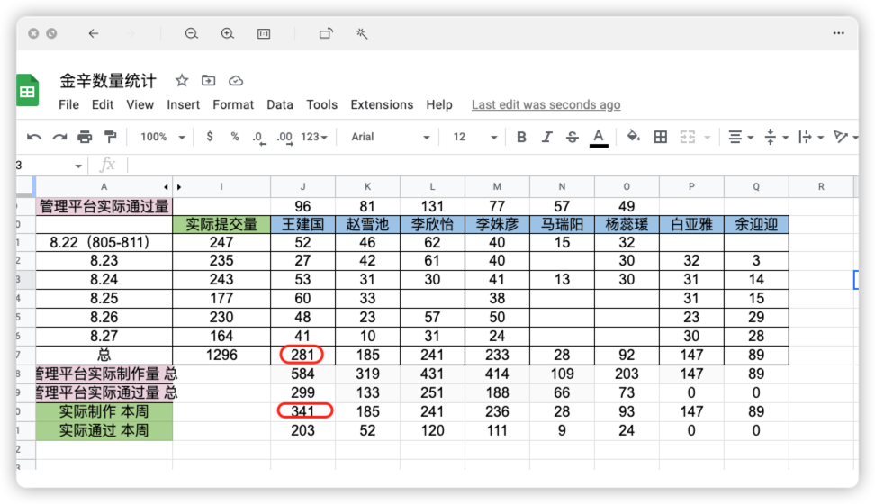
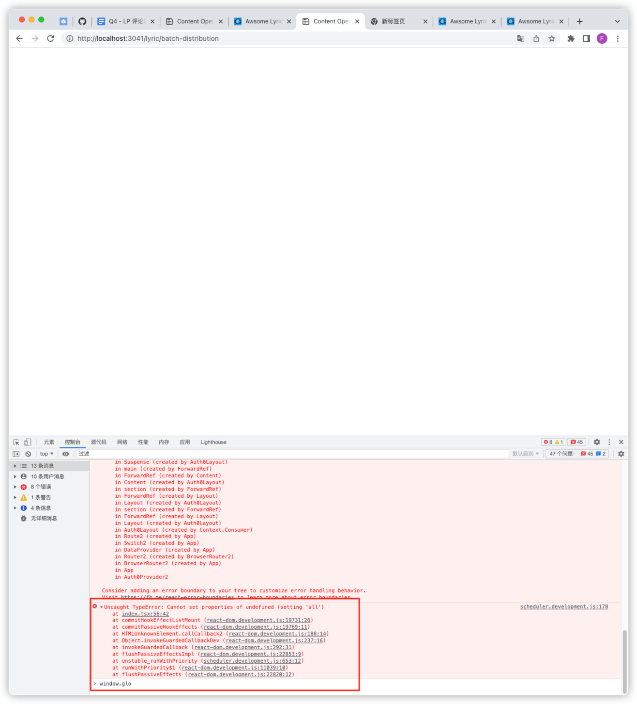
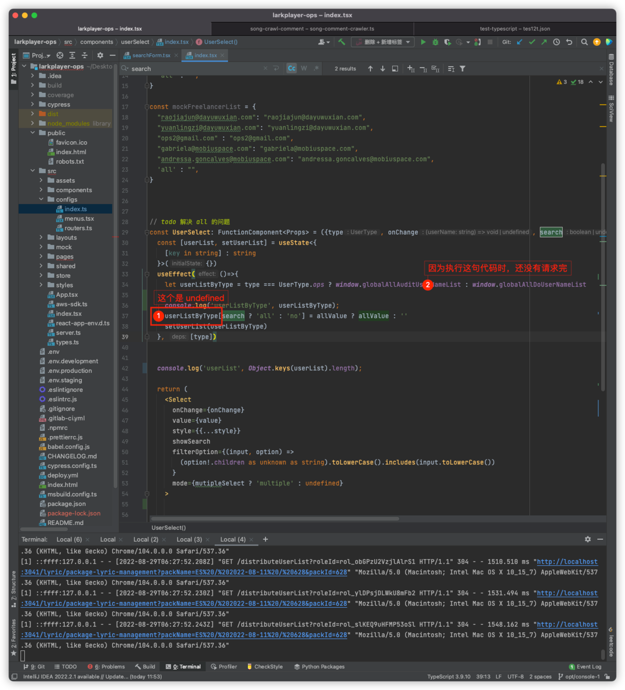

## 2022.08.23 todo

- 生成auditor 不正常的表格
- 【插入】user 数据监控任何人都可以查
- 【插入】临时新增 excel ，用于管理制作完成 = 审核拒绝
- 【插入】andy 账号登录问题
- ❌logan
- ✅SEO 完结
- 【不重要，先不处理】完成优化建议第三 ~ 九点

---

### 生成auditor 不正常的表格

- https://docs.google.com/spreadsheets/d/1ZGbGWfvVfrSSPcD1f9c8s8nLmfeRz8KSwSMe-zqCvrM/edit#gid=0
- 弄好了，但是mana 没有使用，

---

### 【插入】user 数据监控任何人都可以查

- 现在事情太多太杂，可能有遗漏，怎么办？

---

### logan

- 目前核心流程

  - 客户端调用 https://api.larkplayerapp.com/prod/logan/upload node 接口，上传 mp3 文件
  - serverless 将文件转化为 base 64 读流
  - 调用 http://api.larkplayerapp.com/ms-logan-uploader/upload java 服务
  - 将 java 返回的数据（originKey，decodeKey）写入到数据库
- 疑问

  - 文件大小限制是第二步还是第三步？

    直接拿上传失败的文件，调用http://api.larkplayerapp.com/ms-logan-uploader/upload 看看有没有报错

    https://api.larkplayerapp.com/prod/logan/upload

    结果：第二步错误，同样文件，上传 java 服务没问题；上传 node 服务有问题
  - 【todo】测试环境如何跑通
  - 【todo】上传的文件，在哪个地方被转化为 base64

    

    
- 【迭代，接手新项目】

  - 如何本地启动
  - 如何发布不同环境，不同环境的访问路径？
    - 正式环境
    - 测试环境
    - 其他环境
    -
- 【笔记系统 - md流程图语法】https://mermaid-js.github.io/mermaid/#/

---

### 【插入】临时新增 excel ，用于管理制作完成 = 审核拒绝

- 流程

  - 共有 1，2，3，4，5 包
  - andy 认为 2 ，4 包有问题
  - andy 在群上通知我们
  - 我们在群上通知国内兼职
  - 国内兼职重新修改，我们再次通知 andy
  - andy 认为通过，删除
- andy 要做的事情

  - 核心：保证 excel - 2 没有内容

    - 当有包 reject

      excel -1 新增数据
    - 当包通过 audit

      excel - 2删除数据
    - 当包再次 reject

      将数据从 excel - 2 剪切到 excel - 1
- 国内兼职要做的事情

  - 核心：保证 excel - 1 没有内容
  - 将数据从 excel - 1 剪切到 excel - 2

---

### 完成优化建议第三 ~ 九点

- user data monitor 支持 serior 权限

  - 【larkplayer-ops auth0 目前的权限问题】

    - 现有四级权限：（权限从低到高）

      - lp:distribute:do
      - lp:distribute:distribute
      - lp:distribute:audit
      - lp:datamonitor
    - 需求

      
    - 可能的需求变更（检验新权限架构能否 cover 住）

      - 新增第五权限，只有第五权限才能看
      - 第三权限也可以看
      - 中国和外国工作者都是第一级权限，但是需要区分这两种角色国籍
- auth0 userlist selector 减少无意义请求

  - 核心诉求：组件只会在页面加载时获取一次数据，之后不再获取
  - 问题：由于页面加载时，并没有加载 auth0 userlist selector ，导致无法触发获取数据事件，是否修改为：只请求一次用户列表，之后都使用第一次请求的数据？【是否是管理平台的架构缺陷？缺少一个全局 store】

---

### 【插入】andy 账号登录问题

- 原文

  ```
  about it, I can't login with my first login (andressa.goncalves@mobiuspace.com) because I don't remember the password and when I click to reset the password the Auth0 send the email for me in andressa.goncalves@mobiuspace.com, but I don't know how to login in this email [敲打] the only email that I have in the company is andressa.goncalves@dayuwuxian.com but I didn't receive the email from Auth0 to reset my password. Did you know how to solve it? It's important because I need to give access for the new freelancers today
  ```

---

## 2022.08.24

### todo

- 开始完成评论爬取方案调研

---

### 开始完成评论爬取方案调研

- nest  使用

  - 如何在 nest 发 http 请求

## 2022.08.25

### todo

- 完成 logan
- 【插入】seo

---

### 完成 logan

- 如何判断 string 空？

  StringUtils.isBlank("") => true

  StringUtils.isBlank(null) => true
- spring boot 如何连接 dynamodb ？

  需要 endpoint ， accessKey ， secrekey 三个数据
- sprint boot 请求链路

  controller => Service - interface => ServiceImpl - class => repository - interface => model
- 【注意】使用 java 连接dydb 后，有没有可能清空 dydb 数据？

### 【插入：下周实施】seo

- 新增 snaptubebr.com/faq
- post 支持 schema
- snaptubebr.com/faq-pt 和其他走 no-index

## 2022.08.26

### todo

- 优化管理后台

---

### 优化管理后台

- user datamonotor 数据错误？
- ✅ 不可制作 tool 添加标记入口
- ✅ 不可制作 console 新增 status 展示与查询
- 在任务维度监控面板下，新增全部人累计制作数量数据
  - 实现
    - 在 task datamonitor 获取所有userName
      【后台管理系统架构 优化】目前通过 window.xxx 的方式对 userList set 、 get
    - 当 任务类型 + 起止时间 + 区域 查询条件发生变化，才执行查询操作
      如何使用 mobx 实现？
    - 将查询结果计算成 allMakeSuccessTotal 值
    - 前端使用 allMakeSuccessTotal 值
  - 查询 user-latitude userName = all 得到数量
  - 查询 user-latitude userName = 所有人 相加，得到数量
  - 检查这两个数量是否一致

    - 一致，直接在任务维度使用 all 的数据即可
    - 不一致，问 shiwei 原因，看下哪个数据是全部人累计制作数量

      // 累加 08-23  makeSuccessTotal = 累计制作总量 数据  3854
      // 累加 08-24  makeSuccessTotal = 累计制作总量 数据  4437
      // all 08-23  makeSuccessTotal = 累计制作总量 数据  10162
      // all 08-24  makeSuccessTotal = 累计制作总量 数据  10162
    - 查询所有 maker 的 makeSuccessTotal 数据

      - 查询所有 maker
      - 确定任务类型 + 起止时间 + 区域 + maker
      - 按照时间，将这些数据makeSuccessTotal累加
    - 正常解决方法：

      - 将makerUser 没有 email 全部转化为有 email ， 兜底是 and的 email
- 连接线上环境数据库 mfmc

  mfmc -w 3333

  http://wiki.platform.mobiu.space/page/display?document_id=709

/ms-map-seed-server/song-dashboard-user/user-latitude

makeSuccessTotal = 累计制作总量
makeTotal = 制作 => 通过审核

---

## 2022.08.29 ~ 2022.09.02 计划

- 输出歌词调研结果

- 执行后台管理系统优化

- seo

---

## 2022.08.29 周一

### todo 

- 【09：00 ~ 10：00 、 】解决上周遗留后台管理系统剩余优化内容
- 【10：00 ~ 12：00 】开始调研歌词爬取
- 【插入】检查某人的歌词数量是否有问题
- 处理 andy 问题

### 本日出现问题

- 寻找歌词数量原因花费太多时间，实际应该用了11：00 ~ 16：00 ，5 个钟
- 解决 set  'all' to undefined bug 同样花费太多时间，

---

### 解决上周遗留后台管理系统剩余优化内容

- 【09：00 ~ 09： 42】完成制作总量和审核总量的数据统计

- 【数据管理】：条件searchform 调用

- ts 类型

  ```typescript
  export const FrontEndTaskDataMonitorKey = getObjKeyFromInterface<keyof FrontEndTaskDataMonitor>()
  
  export function getObjKeyFromInterface<T extends string>(): StringEnum<T> {
    return proxy as StringEnum<T>
  }
  // 现在需要让 FrontEndTaskDataMonitorKey 支持 a: string 
  ```

---

### 开始调研歌词爬取

- 本周产出（目标）
  - 同一首歌通过不同爬取源爬取结果 总结表
    - 爬取源：youtube genius Albumoftheyear resso
    - 数据：爬取评论数量 
  - Top 1k 爬取结果 总结表
    - 爬取源：youtube genius Albumoftheyear resso
    - 数据：爬取评论数量 是否爬取选定的歌曲（爬取正确率）
- 【resume】从零到一搭建企业级爬虫流程，包括

---

### 【插入：做到15：12】检查某人的歌词数量是否有问题

- 现象

  281 是兼职自己计算的数据；341 是平台结算的数据；平台多算了制作完成的数据

  

- 【todo】原因

  341 中，存在需要人工制作歌词 + MAKE_SUCCESS 的数据，这两种数据按正常是不能共存的，后面发现这样的数据有 60 条

---

### 解决报错

- 这个报错是什么意思

  

  

  解决方法：
    - 使用这个帮助函数：https://codesandbox.io/s/charming-chatelet-j9uihs 当有数据的时候，才执行回调函数

---

### 处理 andy 问题

- 现象

  - auth0 配置添加用户，但是在 console 找不到

    

- 原因

  - 通过 `https://mobiuspace.auth0.com/api/v2/roles/${roleId}/users` 接口获取的用户数据，最大只能请求 50 个，现在是 52 个，所以 andy 提出来有问题

- 解决方法

  - 需要使用其他api `https://manage.auth0.com/api/roles/rol_obGPzU2VzjlAlrS1/users?include_totals=true&page=0&per_page=10`
  - 在 apifox 中使用这个 api + 自己拼接的 token 是否正常请求到数据

- 测试功能
- 剩余 todo
- 新知识

---

## 2022.08.30 周二

### todo

- 完成上周需求

---

### 【10：00 ~ 16：16】为包新增包时长

- 需求

  - 展示歌曲的时长

  - 打包接口新增时长变量

  - 展示 、 查询包的时长
- 【数据管理框架】后端返回的数据类型如何命名？

  - 后端返回数据命名为 BackendTodo 
  - 前端使用的数据命名为 FrontendTodo
  - 后端 searchForm 命名为 BackendSearchForm
  - 前端 searchForm 命名为 FrontendSearchForm
- 【数据管理框架】设计组件的原则？
- react 组件代码结构

  - useState 
  - computedValue computedFn
  - useEffect
  - fn
  - onxx
- 修改的时候，按照接口 => types => state => 前端组件进行修改

---

### 解决 ts 报错

- 【工具使用】idea 排除exclude 、指定 include 目录


---

## 2022.08.31 周三

### todo

- user data monitor 新增时间段内制作数量
- 突破最多显示 50 个邮箱限制
- 完成 distribute 内容第九个项优先
- 完成 distribute 内容
- seo

---

###user data monitor 新增时间段内制作数量

- 凡是 点操作，都需要保证点操作之前的数据是否存在，

- 【迭代】变量命名??

  - List

  - Obj

  - object 读取到的数据

    ```
    const todoDescObj = {
    	title: "吃饭",
    	content: '吃饭饭'
    }
    const userNameTodoDescObjListObj = {
    	rao: [todoDescObj, todoDescObj],
    	rao1: [todoDescObj]
    }
    const TodoDescObjByUserNameList = userNameTodoDescObjListObj['rao']
    ```

---

### 【todo】突破最多显示 50 个邮箱限制

- 假设数据有 101 条，单次请求最大数量为 100，如何保证获取到所有数据？

  promise  + 循环 + 条件判断

---

### seo

- 新增 snaptubebr.com/faq

  - 现在已经有了 https://www.snaptubebr.com/faq-pt/

    是否新增这个？

    

- post 支持 schema

  目前 post 无法输入 schema 的原因是没有启用 yoast 插件

  

- snaptubebr.com/faq-pt 和其他走 no-index 

  https://www.snaptubebr.com/faq-pt/

  https://www.snaptubebr.com/faq-pt/update/how-to-update-my-snaptube-app/ 

  期待结果：上面两个页面能找到 no-index

  https://www.snaptubebr.com/faq/

  期待结果：上面页面无法找到 no-index 

  「snaptubebr.com/faq-pt 和其他走 no-index 」页面新增 meta 标签

---

### 继续完成后台优化

- input ，当 input 有焦点时，全选内容

    onFocus={(event) => event.target.select()}

  

---

