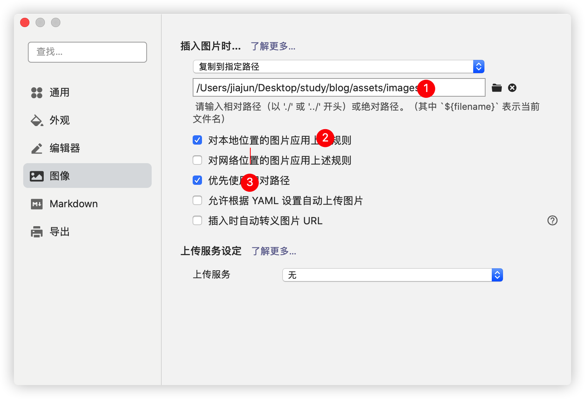
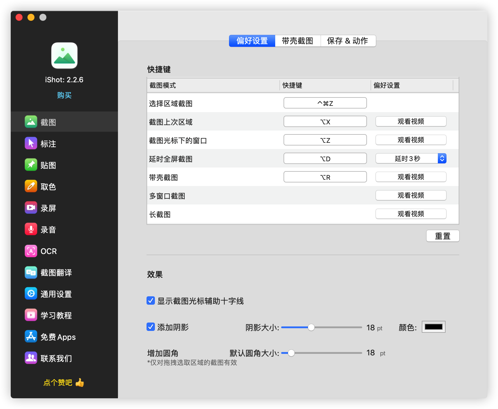
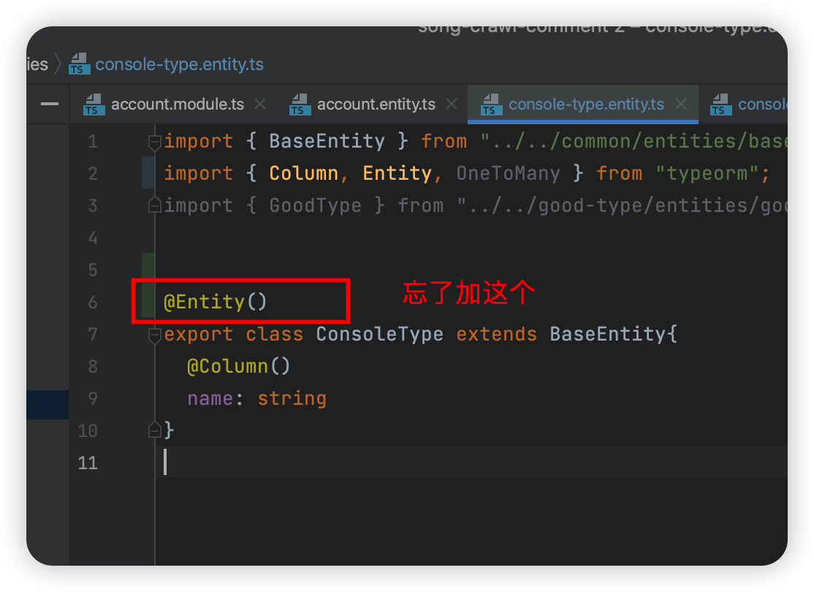

## 2022.10.24 周一

### 问题

1. 这年实际招了 2 个前端，一个高级，一个中级。实际需求是一个高级
2. 有个业务方 leader 年初入职吗，发现可支配的手下技术人员很少
3. 因此这个 leader 说要做一个 CMS 后台，并且说明这个 CMS 后台需要一个前端和一个产品。因此招了中级前端
4. 中级前端的工作：花了 5 个月的时间，将一个收费的可视化拖拽生成页面的库接入到 wordpress 后台
5. 这个事情上层不满，时间花费太多，并且效果不好
6. CMS 11 月份项目完结，但是中级前端和产品在我们公司没事情做了

---

## 2022.10.25 周二

### 封装请求的最佳实践


## 2022.10.26 周三

## 2022.10.27 周四

### 埋点功能

1. 目的、作用

   对关键流程记录当时数据

1. 流程

   1. 客户端、服务端调用埋点

      ```
        sa.track('mp3converting_others', {
          action,
          label,
          event_name,
          ...extra,
        })
        // 事件分组为 mp3converting_others， 后面的对象数据内容是随意的
        
      ```

   2. 回收埋点

   

### 如何阅读代码

1. 最简单的情况：纯函数，函数的输入通过参数传递，不存在副作用


## 2022.10.29

### typora + 图片最佳配置

1. typora 图片上传配置

   

2. 新增 alias：cd /Users/jiajun/desktop/study;git add .;git commit -m "init"; git push 

----



## 2022.10.30 

### 大宇工作总结

1. 思考 - 执行 - 测试

2. 一次做对

3. 每周固定时间总结

4. 说清楚一件事情能力

5. 目标 -> 分解成小目标

6. java 一直都有学，但是始终无法写代码；nest 也是

7. 了解项目的模版

   - 非技术角度
     - 项目背景
     - 项目作用、目的
     - 项目适用方
     - 核心功能
   - 技术角度
     - 入口文件
     - 如何本地启动
     - 如何发布、部署到线上环境

8. 先深度，再广度

9. 问题优先级

   1. 工作遇到不懂的问题，必须及时解决，保证下次遇到同样问题花费更少时间解决
   2. 总结，总结，总结，总结的时机是遇到相同问题的时候

10. 如何做好事情？

    1. 确定事情的重要程度（优先级）
    2. 我做的事情，在整个事情的定位是什么？我在执行的角色是什么？
    3. 反思：如果重新做，我会怎么做

11. 如何做笔记，迭代模版

    ```
    ### 【 新知识/需求/bug/流程 】promise 是什么？
    - 总结：
    - 
    
    
    
    ```

    

12. 看了我的总结，思维总是在原地打转，总是出现同样的错误，我认为最大的原因是输入不足，输出也不足

13. 对比学习法最适合我

14. 对自己的未来负责，时间作为土壤，使用时间做了什么，就会收获什么，人活着的价值不仅仅是工资

    > 本周六和周日的早上都尝试了学习，感觉非常不错，知识吸收程度很高，如果平时的工作日能达到周末的学习，工作效果那该多好？

15. 如果现在重新回到疫情风控的那一个星期，我会怎么过？

    > 2022.03.21 周一 12:43 居家办公
    >
    > 上周的状态和心态非常差，非常想找人倾诉。想到工作的事情，心跳会加速，会紧张，事情也无法开展。这样的状态，与我初三上体育课前状态、赢家上班时接外包状态、赢家上班时完成bos4.0状态相似。具体表现为：食欲不振、呼吸偶尔困难，精神非常紧张，但是做事情的时候又没有精力，容易被外界影响。

16. 问问自己在做什么，尝试从错误的方向调整到正确的方向

17. 每周微信朋友圈发布一条动态，私密

18. 完成还原静态页面需求的过程中，在不知道「如何还原静态稿」情况下，就去实现需求，造成返工与对结果没有信心

19. 对自己的产出负责，有信心，保证自己交付的内容都没有问题

20. 重新再做一遍使用google script 临时做后台管理，会怎么做？

---

### 【疑问】数据库：涉及到表的关联，应该如何处理？

- 假设班级和学生两张表，需要表示两者关系，直接在学生表新增字段，保存班级id。就能保存两者的关系了，为什么还要新建第三张表？

---

### 【疑问】更新了entity ，数据库没有更新



---

### todo

- console-type 的列表接口
- good-type 的列表接口
- account 的列表接口

---

### 【新知识】如何设置nest 的路由path params参数与query params查询参数？

- 需求1：在 controller 层，读取参数，请求: http://localhost:3009/student/1 中 1 的路由参数

  

- 需求2：在 controller 层，读取参数，请求: http://localhost:3009/student?parentId=2 中 2 的路由参数

  ```
  @Get()
  findStudentByParentId(@Query query){
  	console.log('query', query) // 返回一个对象{parentId: 2}
  }
  ```

  
