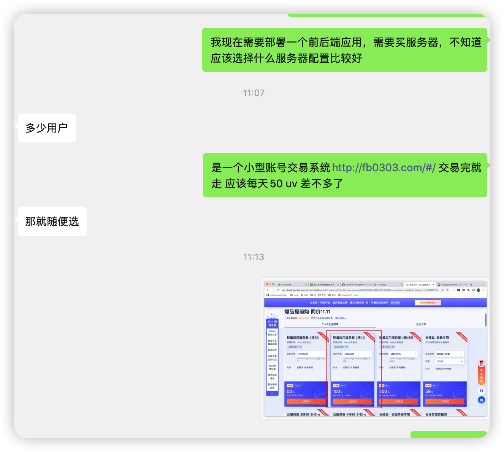
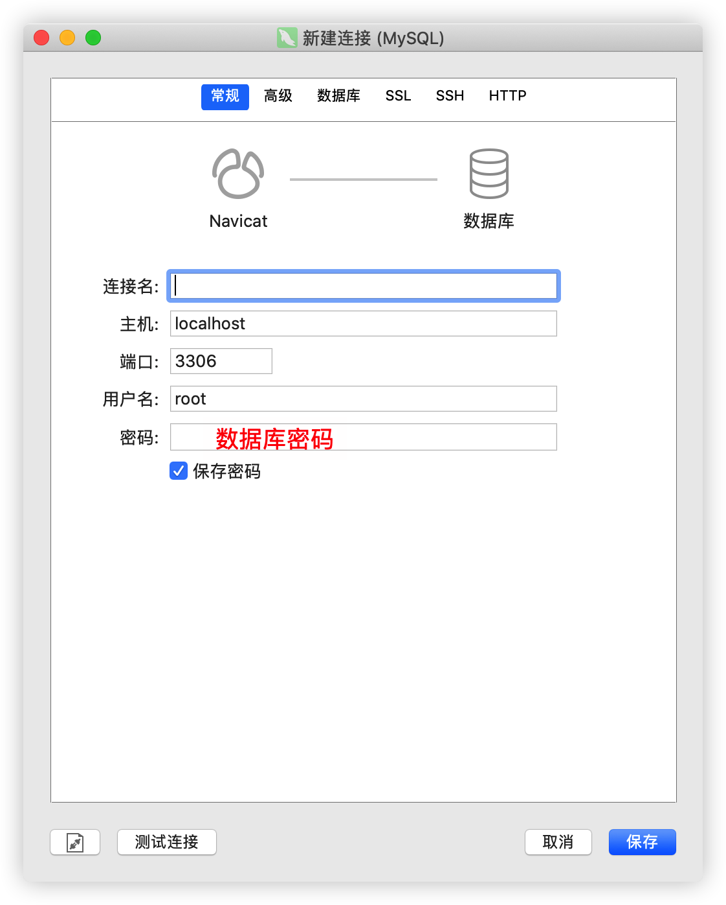
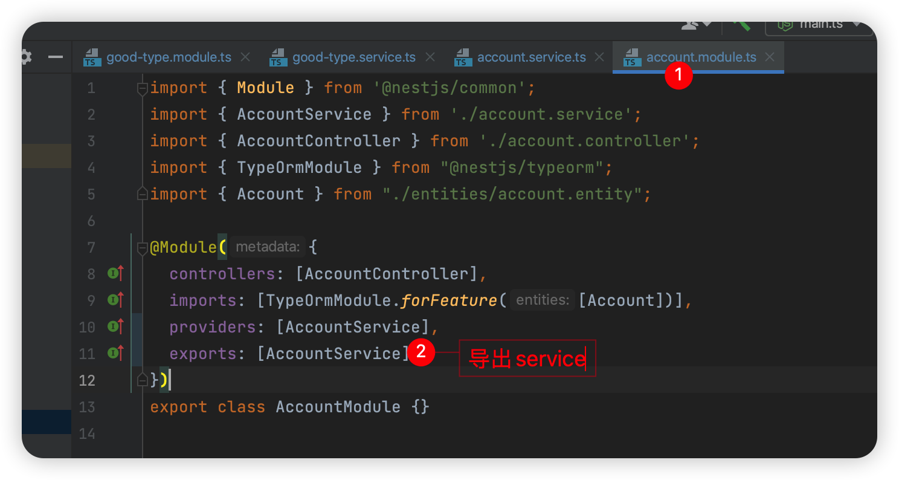
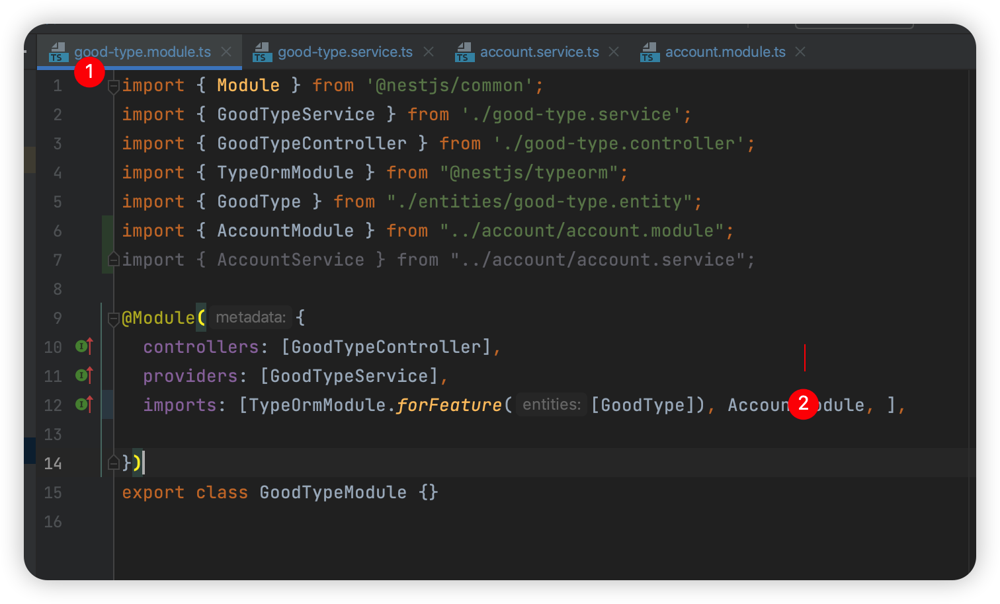
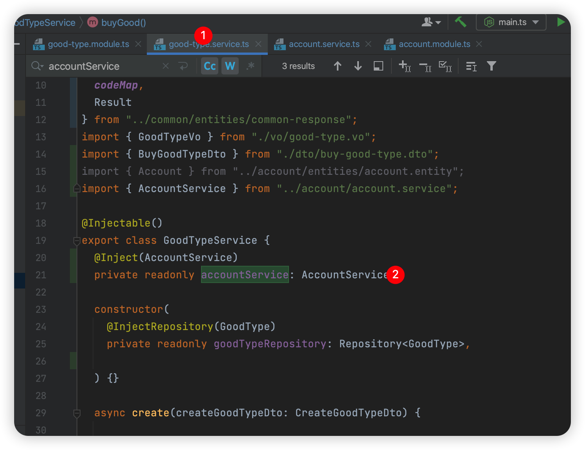

## 2022.10.31 周一

### 账户系统todo

- 支付宝接入
- 服务器环境配置与购买，前后端代码部署
- 完成核心流程
  - 列表展示页面
    - 前端项目搭建
    - 调用接口 
  - 购买流程页面
    - 完成接口开发
    - 前端调用接口
  - 查看购买结果

---

### 【新知识】搭建线上环境全流程

#### 服务器配置选择



#### 如何连接服务器？

- 需要以下信息

  ip 、用户名、密码、就够了

- 新增文件config 

  ```
  cd ~/.ssh/
  vim config
  # 在 config 文件编辑以下内容
  Host tenxunyun
  Hostname 购买的服务器ip地址
  Port 22
  User root 或者子账号
  ```

- 通过 `ssh tenxunyun`进入，输入密码

---

#### 购买域名的流程

没有特别的问题，按操作就好了

---

#### 服务器需要如何进行配置？

- 安装 mysql 

  https://blog.csdn.net/weixin_42678675/article/details/124090783

- 使用 navicat 连接服务器mysql数据库

  

- 在 navicat 或者服务器创建databases，因为代码不能创建

#### 部署后端服务

- 使用pm2 部署 nest 服务

  ```
  npm install pm2 -g 
  # 打包 node 后端， 生成 dist 目录，将 dist 目录上传到服务器
  # 进入到 dist 目录
  pm2 start main.js  --name account  // start 启动
  pm2 list # 检查是否启动 account
  ```

- 已知端口号，查看 pid

  lsof -i tcp:portnumber

- 根据pid ，查看端口号

  ??

- pm2 常见命令

  ```
  pm2 start dist/main.js --name account # 启动服务
  pm2 list # 检查当前 pm2 启动情况
  pm2 stop ${id} # 停止node 服务
  pm2 delete ${id} # 删除node服务
  ```

- 压缩整个项目成 zip， 准备上传到服务器

  - 如果这个项目被 git 接管

    ```
    $ git archive -o ./dist.zip HEAD # 生成share.zip 压缩包
    ```

  - 如果这个项目没有被 git 接管

    ？

- 在本地的命令行执行以下命令，上传本地 dist.zip 到服务器

  ```
  $ scp /Users/jiajun/Desktop/project/account_website/back-end/dist.zip root@121.4.27.105:/var/project/account/back-end
  ```

- 使用 pm2 启动

  ```
  pm2 start dist/main.js --name account
  ```

- 在服务器启动正常后，外网通过什么方式访问？直接通过 http://服务器ip/account 无法正常访问

  是否应该通过nginx 进行服务的转发？

#### nginx配置

- 安装过程忽略

- 检查nginx 配置，发现监听了80端口，并且是一个index.html 文件，尝试通过 http://ip 访问，发现返回502

- 常见nginx 命令

  ```
  sudo systemctl status nginx # 命令行检查nginx 状态
  nginx -t # 测试配置是否正确
  sudo systemctl restart nginx
  sudo systemctl stop nginx
  ```

  


#### 部署前端服务

```
1. 手动修改配置
2. npm run build
3. zip dist11.zip dist/* -r
4. scp /Users/jiajun/Desktop/project/account_website/front-end/vite-project/dist11.zip root@121.4.27.105:/var/project/account/front-end
6. cd /var/project/account/front-end
5. unzip dist11.zip 

```

#### 域名与ip地址绑定

- 购买二级域名后，根据项目，新增三级域名，如account.rjjgzs.com

#### 线上前后端服务联通

- 最重要的是根据环境变量，使用不同的数据库配置or接口调用配置，


---

### 2022.11.01 周二

### 【新知识】数据库操作：join 的作用

- inner join 思路
  - 先确定主表
  - 在确定副表
  - 确定两表的连接关系

---

### 【新知识】在nest 中，Aservice 调用B service 需要做什么？

- 服务划分：consoleType > goodType > account

- 需求：goodType.service 需要调用account.service的服务

- 步骤：

  - 步骤1：被使用方在exports需要被共享的模块

    

  - 步骤2：使用方imports 模块

    

  - 步骤3：使用方使用被使用方的函数

    

---

## 2022.11.02 周三

### 【新知识】如何做错误处理？

- 分为业务错误与非业务错误

  - 业务错误，httpcode === 200，具体业务错误数据结构如下

    ```
    {
    	code: '00000',// 业务结果,00000表示业务正常
    	data: any,
    	result: 'ok' // 这里返回业务错误信息
    }
    ```

  - 非业务错误，httcode !==200 ,会被前端axios封装层提前处理，具体数据结构如下

    ```
    {
        "statusCode": 400,
        "message": "email is invalid",
        "error": "Bad Request"
    }
    ```

---

### 后端代码部署

```
# 手动修改数据库密码

git archive -o ./dist.zip HEAD # 将后端源代码打包

# 云服务器
cd /var/project/account

rm -rf back-end

mkdir back-end

# 本地开发环境
scp /Users/jiajun/Desktop/project/account_website/back-end/dist.zip root@121.4.27.105:/var/project/account/back-end # 上传到云服务器


cd /var/project/account/back-end


unzip dist.zip

npm install

npm run build

pm2 start dist/main.js 

pm2 list
 
```

### 前端代码部署

```
# 本地开发环境
npm run build

zip dist11.zip dist/* -r

# 云服务器
cd /var/project/account

rm -rf front-end

mkdir front-end

# 本地开发环境
scp /Users/jiajun/Desktop/project/account_website/front-end/vite-project/dist11.zip root@121.4.27.105:/var/project/account/front-end

# 云服务器
cd /var/project/account/front-end
5. unzip dist11.zip 
```

