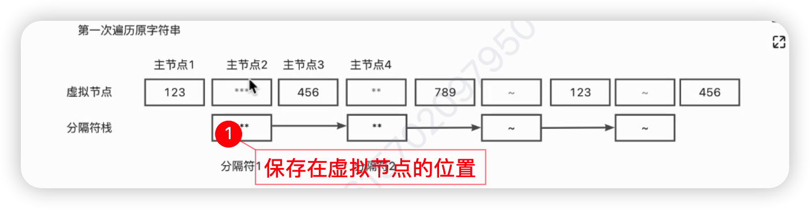

## 周总结

## 2023.01.02 周一 

### todo

- 完react hooks 的常见面试题
  - 理念
  - useState 实现
  - react 执行流程

## 2023.01.07 周六

### 编辑器

- 每个op 都必须有inverse 函数，返回这个op 的反向操作
- 分层架构
- 解析器实现
- md语法分为行内样式和块元素
  - 行内标签写在开头，并且不需要闭合
- next 是兄弟元素，firstChild 是父子元素
- 使用 treeworke生成dom节点树
- 新建一个分隔符栈（使用链表，保存所有特殊符号）
- 
- strong 节点的子节点是text 节点
- 为什么Strong 节点不保存456值，而是把456 节点作为Strong节点的子节点？
- 

## 2022.01.14 周六

### todo

### 编辑器

- treewalker 指的是如何进行遍历链表
- 

