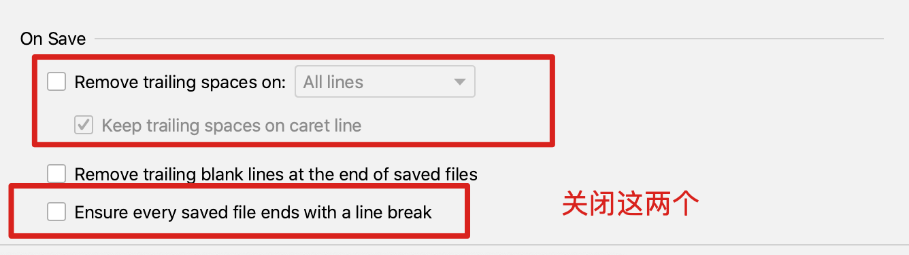

## 周todo

- ~
- grid  布局学习
- react 组件重复渲染问题
- react 自定义 hooks
- felx布局


## 2023.02.13 周一

### 设计稿长度转化为代码长度

- pc： 使用 rem 代替 px
- h5：使用 px 


### grid 布局

- `<Row span={1} sm={2}> ` 表示 sm 有两列，其余都只有一列


## 2023.02.14 周二

### react hooks 定义组件疑问：在组件内部，通过函数的方式声明子组件，是否合理？

```
function App(){
	const [count, setCount] = useState(0)
	const renderOther = ()=>{
		console.log("renderOther")
		return <div>renderOther</div>
	}
	return (
		<div>
			{count}
			<button onClick={()=>{setCount(count + 1)}}>+1</button>
			{renderOther()}
		</div>
	)
}
```

[demo](https://codesandbox.io/s/inspiring-lucy-0ji471?file=/src/App.js)

目前结论，以下方式是最好的：

- 子组件函数定义在函数中
- 子组件通过组件的方式进行调用


### 熟悉布局代码风格

wrapper 》CenterContainer 》 Row  > 内容

### 媒体查询代码含义

**含义与代码相反**，如下面代码的含义是当 **宽度小于 768px**，添加border

```
@media (max-width: 768px) {
	.bs-banner-wrapper {
    border: 1px solid red;
  }
}
```

### idea 设置： 不要自动加风格代码




## 2023.02.15 周三

## 2023.02.16 周四

### 自定义 hooks 疑问：hooks 返回普通对象或者普通函数，可以吗？


### 自定义 hooks 疑问：自定义 hooks 的返回值是一个实例吗？也就说A处修改之后，B处读取会跟着变化吗？

不是一个实例
