## 本周新知识

### 如何在 react 代码中区分环境？


## 2023.02.20 周一

### 修改项

- 改成 您的理由

  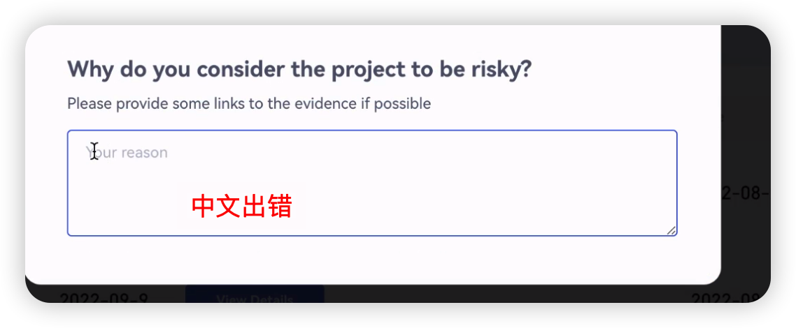

- ~~Access Number 权限数量~~

- ~~Historical triggers 历史触发~~

- 【？】中文状态下排序有问题

  测试环境接口是否有问题？

- 查看详情 view 逻辑确认

  - /api/landingPage/ticket/detail 这个接口，传入的是 BITCOIN ，数据为空，正常吗？

    正常，目前有几种解决方案：

    - 提示弹窗
    - 不展示未审计的币种

- 为什么测试环境的数据和本地环境不一致？

  左边是测试环境，右边是本地环境

  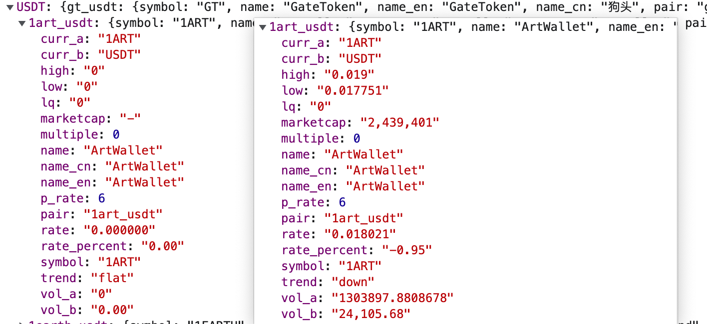

  

- icon 图片404 了

  测试环境的问题

  - https://www.gate.io/images/coin_icon/64/ejs.png
  - https://114.55.238.130:13555/images/coin_icon/64/ejs.png

  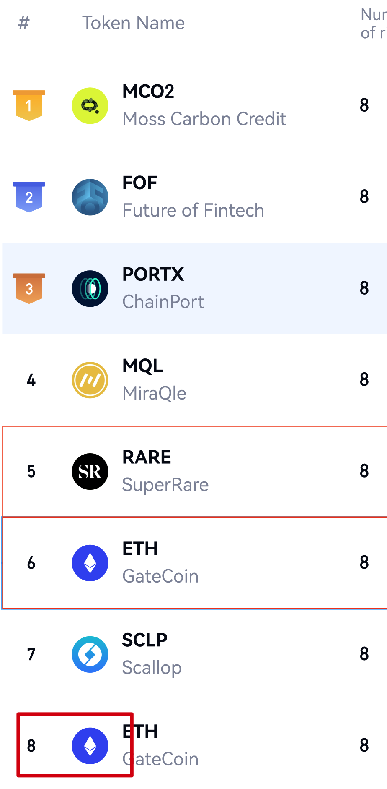

- ~~Action 和 token name 颜色调整~~
  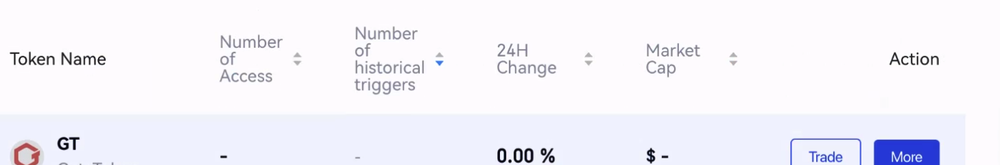

- 3

  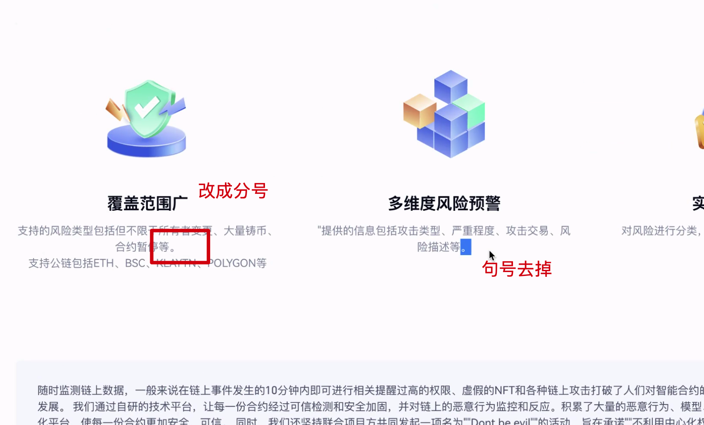

- ~~-- 黑色改成白色~~

  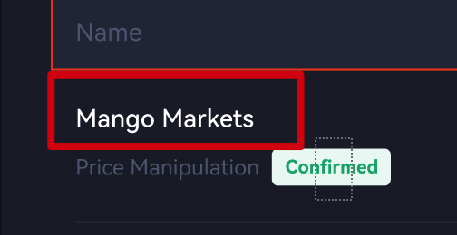

- 使用H5 浅色背景图；banner width 变化 导致图片展示不全

  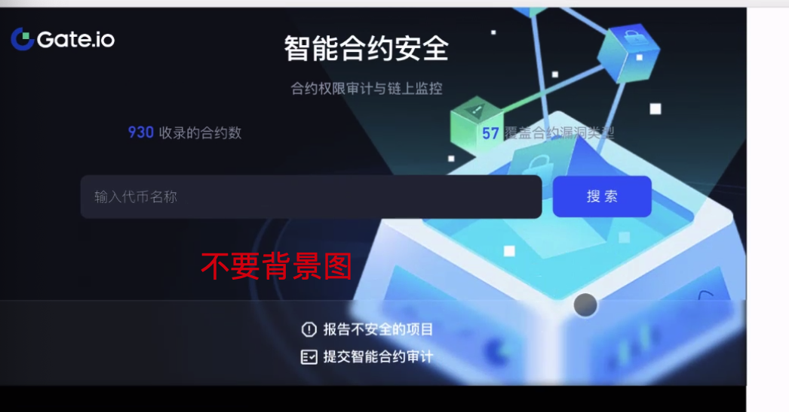

- 颜色错误；内容有重叠

  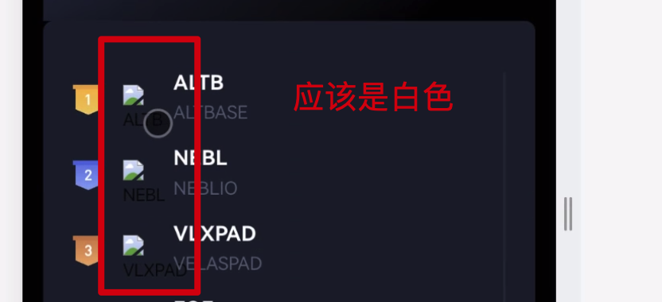

- 8 图片显示不全，在部分width 中

  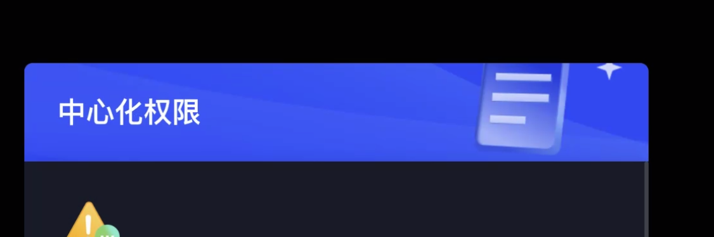

- 【二期处理】9 点击注意项， 高亮右侧的tab

- message 组件提示样式统一

- 【二期处理】 no data 暂无数据

  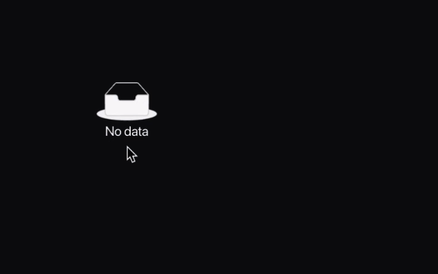

- 800多px 出现问题

  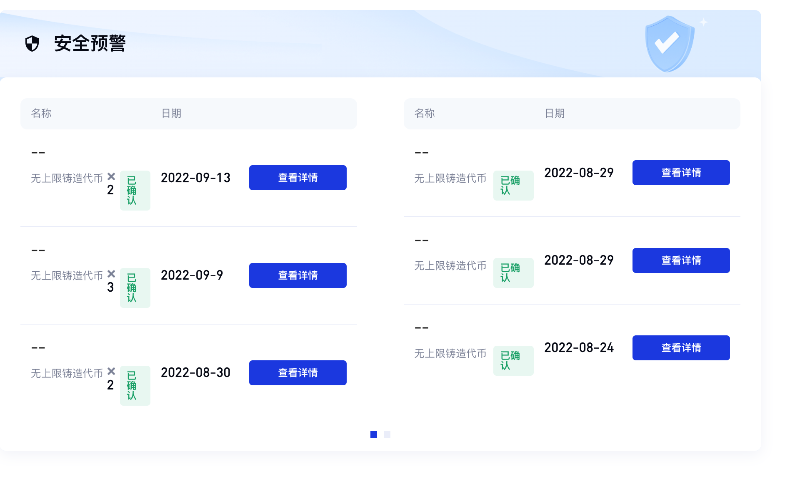
  
- banner 下面的内容40 

  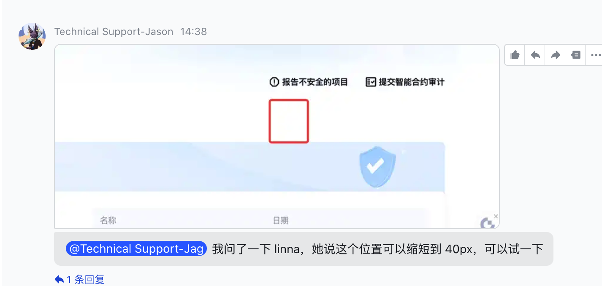

### 理解nft 落地页功能

- 代币、 nft 、碎片的关系？


## 2023.02.21 周二

### 如何快速修改 antd 样式代码

需要再 antd 的基础上做样式的修改，现在想把蓝色的线改变样式；灰色的线去掉，如何实现？

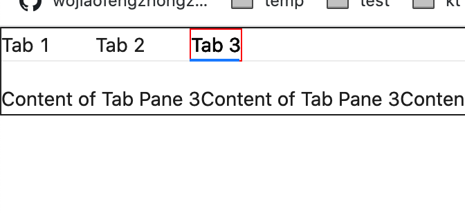


### 确认是否 18 条

和后端确认这个接口是否固定数量数据，是多少条？

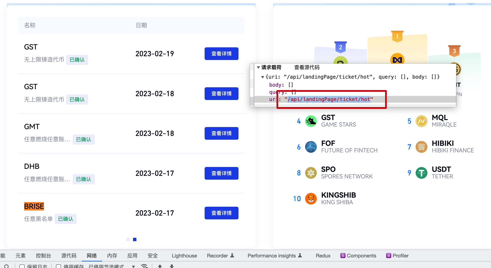

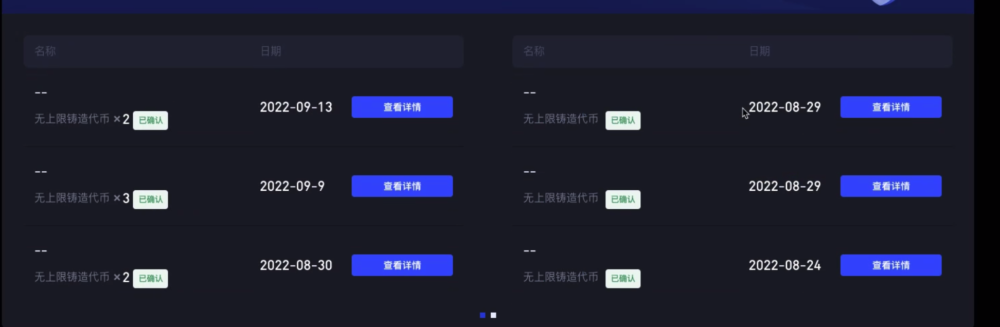


### ~~亮色~~

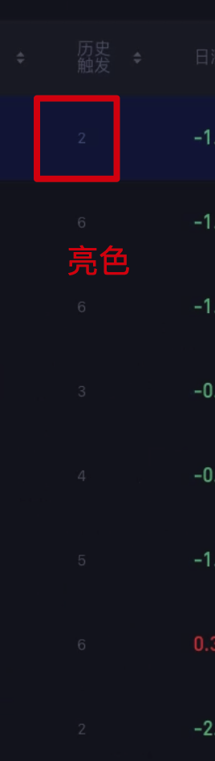


### 和后端确认是否部分币种没有详情

### ~~没有显示三角~~

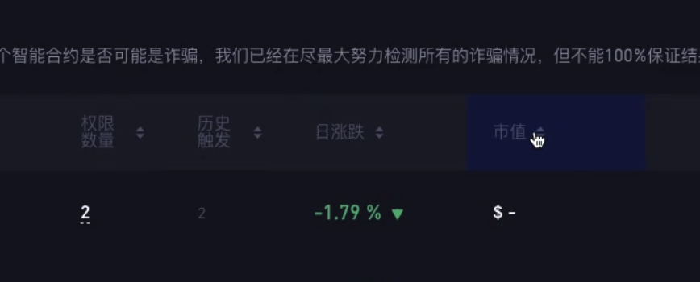

### ~~会抖动~~

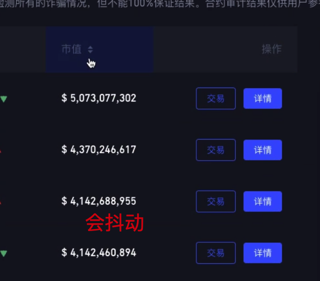

### ~~阿拉伯语~~

- 没有翻译
- 背景图需要重新处理

### ~~横或者竖~~

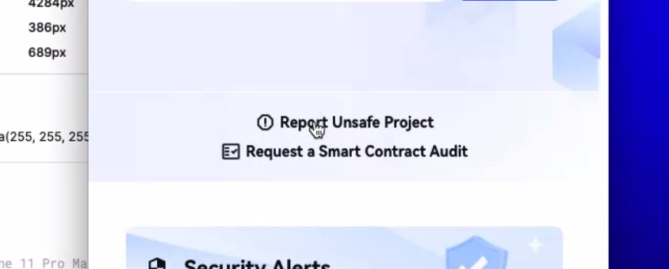

### ~~H5位置是否需要改变？~~

### ~~多语言 name date 处理~~

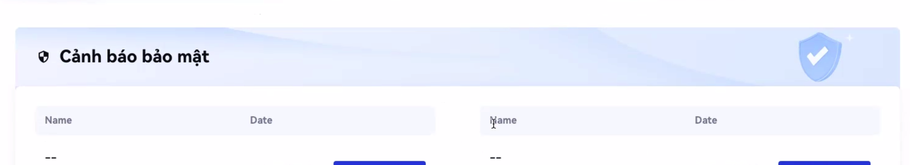

### ~~越南语按钮出现问题~~

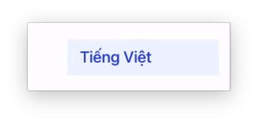

### ~~js报错~~

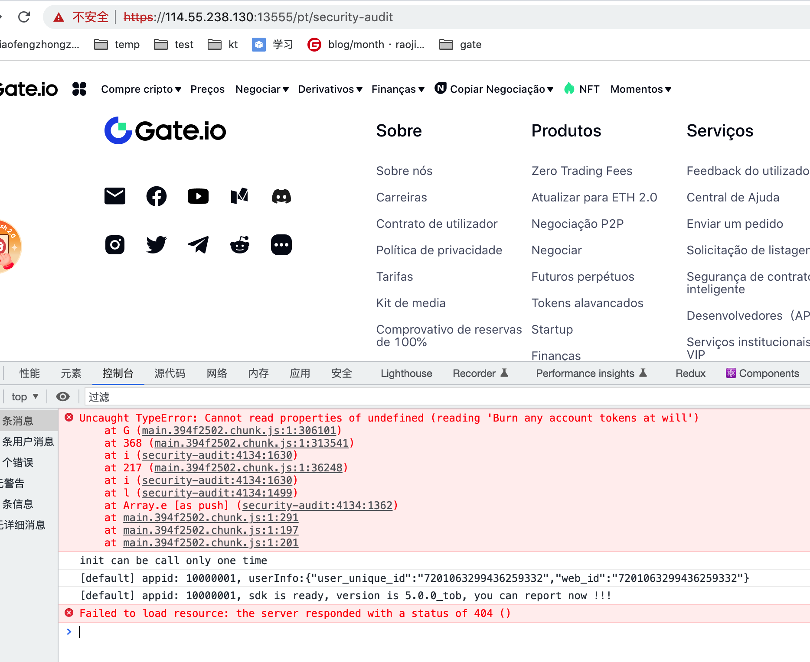

### ~~土耳其语言出现报错~~

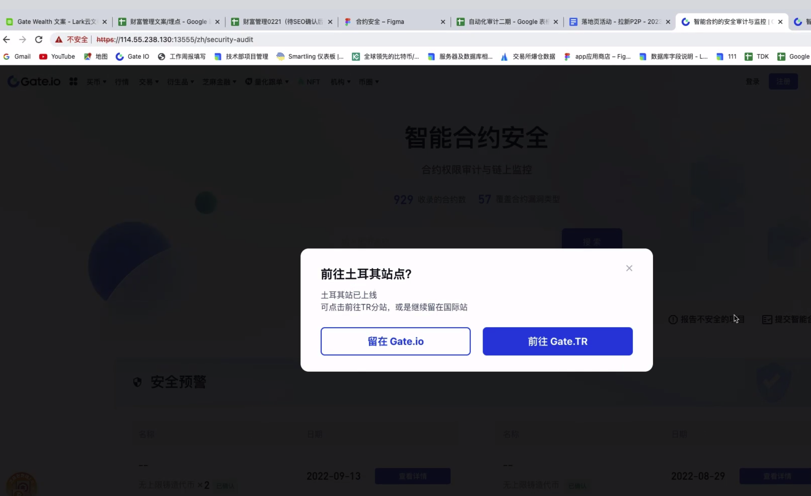

### message 调整

### ~~点击这个组织默认事件~~

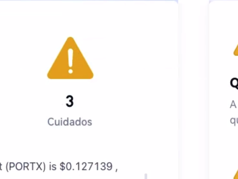

### ~~UI确认~~

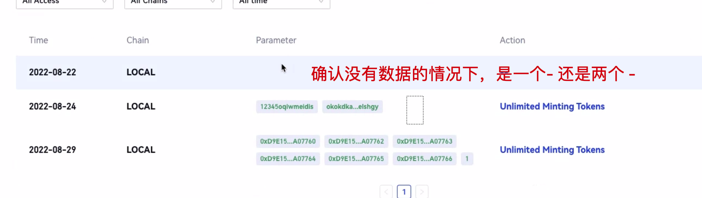

### ~~没有数据多语言~~

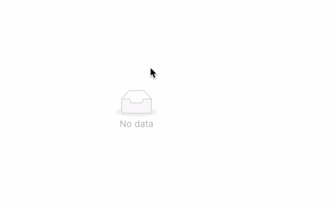


## 2023.02.22 周三

### 可以做的事情

- 低代码工具调研

- 翻译链路优化

- 组件库和常用函数 封装

- 区分环境

  ```
      // todo setRiskHistory 应该使用 // setRiskHistory(data[_activeChainIndex].riskHistory) 
      setRiskHistory(data[_activeChainIndex].riskHistory)
      // setRiskHistory([
      //   {
      //     taskId: '8684e014-330d-4f91-82bc-be5d943c279c3',
      //     type: 'MINT1',
      //     taskName: 'WT',
      //     chain: 'LOCAL',
      //     timestamp: 1661167577124,
      //     args: []
      //   },
      //   {
      //     taskId: '8684e014-330d-4f91-82bc-be5d943c279c2',
      //     type: 'MINT',
      //     taskName: 'WT',
      //     chain: 'LOCAL',
      //     timestamp: 1661331778380,
      //     args: ["12345oqiwmeidis", 'okokdkaleixkelshgy']
      //   },
      //   {
      //     taskId: '8684e014-330d-4f91-82bc-be5d943c279c1',
      //     type: 'MINT',
      //     taskName: 'WT',
      //     chain: 'LOCAL',
      //     timestamp: 1661742273563,
      //     args: [
      //       "0xD9E150FafB778C0C4acbd78F90A6cCC978CA07760",
      //       "0xD9E150FafB778C0C4acbd78F90A6cCC978CA07762",
      //       "0xD9E150FafB778C0C4acbd78F90A6cCC978CA07763",
      //       "0xD9E150FafB778C0C4acbd78F90A6cCC978CA07764",
      //       "0xD9E150FafB778C0C4acbd78F90A6cCC978CA07765",
      //       "0xD9E150FafB778C0C4acbd78F90A6cCC978CA07766",
      //       "1"
      //     ]
      //   }
      // ])
  ```

  

### ~~去掉~~

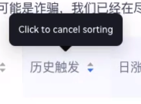

### 按钮位置

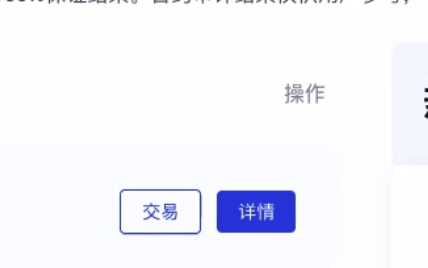

### 阿拉伯语301 到 英语

### 还是不会事情规划

### 写落地页的流程

- wrapper 划分模块
- 模块内部划分区域，对区域进行布局
- 布局模块 -》布局模块内容 -》内容样式调整 -》


### 暗色调整

- 背景
- 字体颜色


## 2023.02.23 周四

### 如何写动画效果

- 分为初始状态和结束状态
- 可以修改html 和 css
  - 修改 css
    - 写好hover 之后的css ，然后在初始状态添加transition: all 0.5s;
  - 修改 html 
    - 

## 2023.02.24 周五

### antd 文档阅读，积累，经验

在查看 api 文档的时候，api 很容易理解和使用，方法如何使用？？

https://segmentfault.com/q/1010000015465494

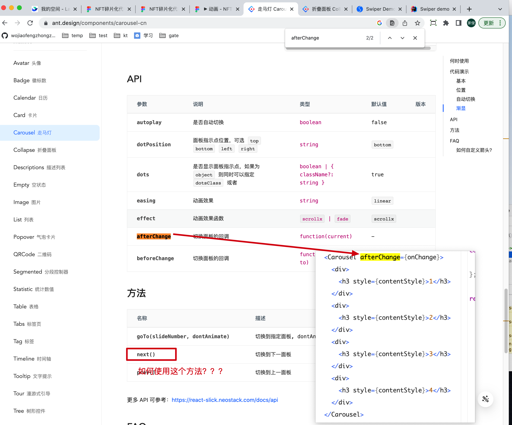

### 合约安全信息

todo

- ~~主页banner 退回原效果~~
- ~~详情页banner 使用新样式~~
- ~~详情页返回主页面功能~~
- 详情页搜索框调整位置
- 详情页点击安全预警，添加高亮效果
- 阿语地区排版

周一出ui图

grey 周二走查


### 

### 阿语地区排版


### 将 ui 层与数据层分层

