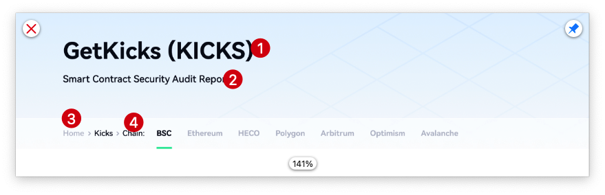
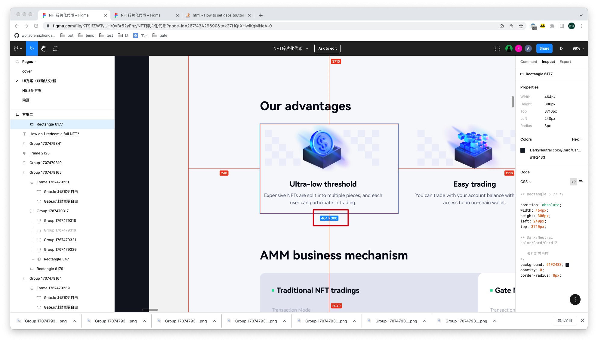

## 周学习

- 封装 自定义 hooks 需要注意什么；收集常用的自定义 hooks
- 适当加班，才能让事情按计划执行

## 2023.02.27 周一

### todo

- 哪个是变化的？全称 简称

  

- 搜索框效果

- 阿语地区未处理

- ~~高亮提示~~

### 图片加载，在 js 处理，防止出现ar 地区情况

### css 文件分为四个部分

- pc + 浅色
- pc + 深色
- h5 + 浅色 
- h5 + 深色

### 组件区分数据层与 ui 层

- 在ui 层，也就是 index.js 读取数据层数据并且展示；还有就是保存前端数据
- 

## 2023.02.28 周二

### 开发落地页面注意事项

#### 图片命名规则

pc-light-banner-ar.png

#### pc 转 h5 要处理的css

- 布局代码
- 值为数字的css 代码
  - 边距代码（需要重写padding 或者 margin 的四个值）
    - padding
    - margin
  - font-size
  - border-radius
  - font-weight

#### 非阿语转阿语要处理的css

todo

### 开发落地页流程

#### 根据 ue or ui 图，检查接口字段是否完备

#### 静态页面阶段

- 完成pc + 浅色模式
-  复制「pc + 浅色模式代码」，完成PC  + 暗色模式
- 完全复制 pc + 浅/暗色模式，完成模块 H5 + 浅/暗色模式

#### 接入接口

#### 测试阶段

- pc 浅色 + h5 浅色
- pc 深色 + h5 深色

#### 走查

## 2023.03.01 周三

### idea 工具，找到原始css 文件

根据 `.bs-token-name-content .bs-token-intro `

找到编辑器的文件位置

### 勇敢说不，遇到问题（mimo提出很多不应该修改的走差点），要沟通

### ui效果有问题，及时说出来

## 2023.03.02 周四

### 尽量不使用 :hover ，而是用 .hover 代替

因为 :hover 无法通过js触发，如果我想在页面加载时，展示 hover 状态，那么使用 :hover 无法实现

### 是否需要指定 width 和 height  

不应该 ，但是应该设置 expensive NFTXXX 的width

### scss 学习

#### 防静电凯撒