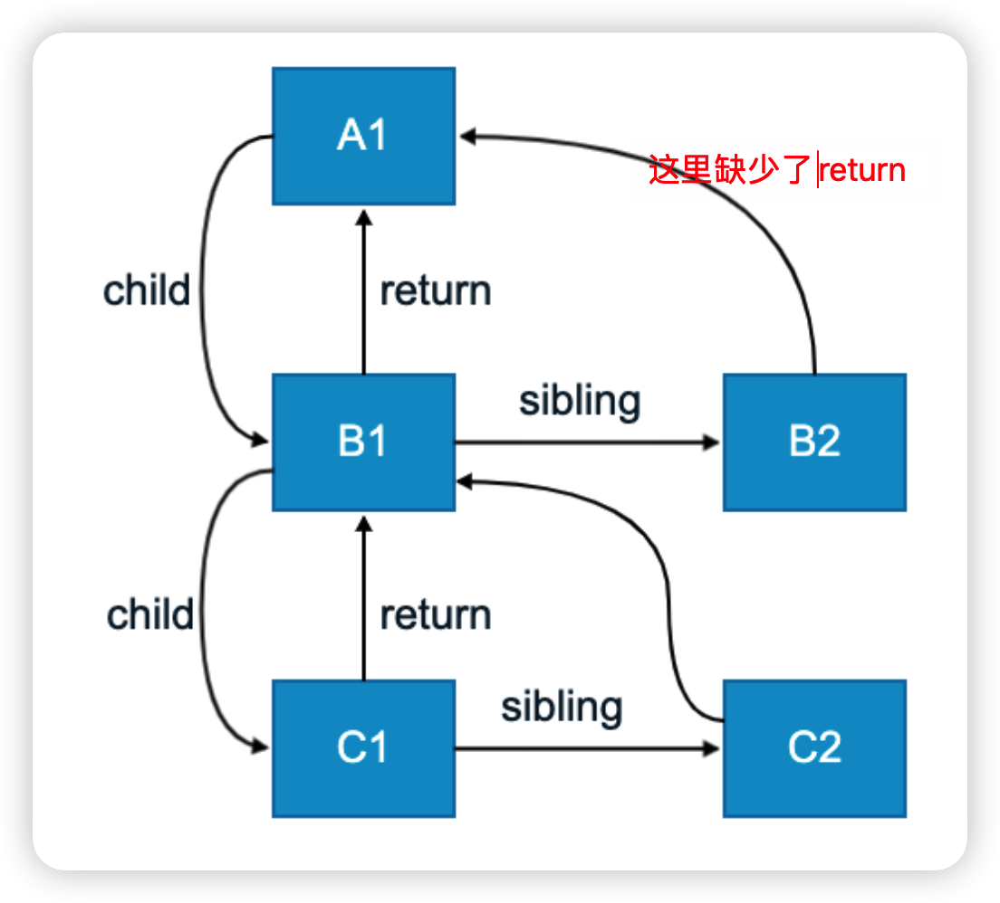

# 学习 React Hooks 笔记

## 本文目标

- 通过最小化的 demo 代码，学习 React Hooks API
- 收集常用的 hooks
- 收集使用 hook 的坑


## Hooks 汇总

- [Basic Hooks](https://reactjs.org/docs/hooks-reference.html#basic-hooks)
  - [`useState`](https://reactjs.org/docs/hooks-reference.html#usestate)
  - [`useEffect`](https://reactjs.org/docs/hooks-reference.html#useeffect)
  - [`useContext`](https://reactjs.org/docs/hooks-reference.html#usecontext)
- [Additional Hooks](https://reactjs.org/docs/hooks-reference.html#additional-hooks)
  
  - [`useReducer`](https://reactjs.org/docs/hooks-reference.html#usereducer)
  - [`useCallback`](https://reactjs.org/docs/hooks-reference.html#usecallback)
  - [`useMemo`](https://reactjs.org/docs/hooks-reference.html#usememo)
  - [`useRef`](https://reactjs.org/docs/hooks-reference.html#useref)
  - [`useImperativeHandle`](https://reactjs.org/docs/hooks-reference.html#useimperativehandle)
  - [`useLayoutEffect`](https://reactjs.org/docs/hooks-reference.html#uselayouteffect)
  - [`useDebugValue`](https://reactjs.org/docs/hooks-reference.html#usedebugvalue)
- Custom Hooks
  - useDebounce

    对数据进行防抖处理


## 官方 Hooks demo


## useContext

### 代码

https://codesandbox.io/s/thirsty-cherry-n7qjn

[更简单的例子](https://codesandbox.io/s/purple-wood-j3wgu)


## useReducer

https://codesandbox.io/s/beautiful-ellis-i057u?file=/src/App.js

## useMemo

- 人民、美元换算工具

  https://codesandbox.io/s/clever-bird-bque7

## useRef

- 模拟 class 组件的 componentDidUpdate（使用 useRef 保存贯穿多次渲染的变量）

  https://codesandbox.io/s/charming-moser-dqjtn?file=/src/App.js


## Custom Hooks

### useDebounce

对用户输入值进行节流操作

- [不使用 debounce](https://jsbin.com/suyuyetutu/1/edit?html,js,console,output)
- [未封装 debounce](https://jsbin.com/zovuvidoze/1/edit?html,js,console,output)
- [封装 debounce](https://jsbin.com/fotuwoteti/1/edit?html,js,console,output)
- [cusTomHook useDebounce](https://codesandbox.io/s/trusting-oskar-o2mkf)


### useAsync 

统一处理异步请求

https://github.com/wojiaofengzhongzhuifeng/test-react-fetch-data


### useUrlQueryParam

返回页面 url 中，执行 key 的参数值


## Hooks 经典的坑

### react hooks 闭包陷阱

- react hooks 例子

  - [例子](https://codesandbox.io/s/interesting-swanson-pks22)

  - 原因

    - 页面加载完毕后，会为 Test 组件生成第一个快照，此时 count = 0
    - 点击 + 号后，会为 Test 组件生成第二个快照，此时 count = 1 
    - 离开 Test 组件后，会执行第一个快照的useEffect 的回调函数，在这个回调函数中获取 count，此时 count = 0

- [react hooks 例子 2](https://codesandbox.io/s/festive-mcnulty-k6hu3)

- javascript 例子
  - [原生 js 例子1](https://jsbin.com/sewadozadi/1/edit)
  - [原生 js 例子2](https://jsbin.com/tavatumima/1/edit?js,console,output)


### useEffect 依赖项是对象或者数组，造成无限渲染

- [例子](https://codesandbox.io/s/upbeat-einstein-ozqpe)
- 原因


### useEffect 依赖项是函数，造成无限渲染

- [例子](https://codesandbox.io/s/festive-sun-mzp7l)
- 原因


### react useState 不能条件调用


## useState 的原理


## Fiber 架构

### requestidlecallback api

将耗时任务安插在空余时间中，防止耗时任务阻塞主线程的渲染任务

空余时间指的是： 1s 如果能绘制60 帧，表示页面不卡顿，那么每帧能分到的可执行时间为 16ms ，如果渲染所需时间小于16ms，如渲染所需时间为10ms，那么空余时间为6ms，可供耗时任务运行，

### react 15 vs react 16

- react 15 对比 dom 的核心问题：耗时任务阻塞主线程渲染任务

  - 由于使用的是递归的方式对比dom，使用的数据结构为stack，如果遇到dom 树层级较深，会导致卡顿出现

- react 16 的解决核心思路：如何实现中止任务的再继续

  -  使用 requestidlecallback 执行耗时任务
  - 废弃递归的方式对比dom，因为使用递归无法中断耗时任务
  - 将耗时任务拆分成小的任务执行

- 数据结构变化

  从树结构，转化为列表结构

### fiber 含义

- fiber 是一个最小任务单元

  - 在 React 15 中，将构建虚拟DOM 当成一个整体的任务，
  - 在 React 16 中，将整体的任务拆分成一个一个小任务，每个小任务指的就是 fiber 节点的构建

- fiber 是一种数据结构

  fiber 对象组成 = vm 对象 + 链表指向所需的数据 + 需要修改的dom操作的数据

  ```
  {
  	//  vm 对象
    type         节点类型 (元素, 文本, 组件)(具体的类型)
    props        节点属性
    
    // 需要修改的dom操作的数据
    stateNode    节点 DOM 对象 | 组件实例对象
    tag          节点标记 (对具体类型的分类 hostRoot || hostComponent || classComponent || functionComponent)
    ?effects      数组, 存储需要更改的 fiber 对象
    ?effectTag    当前 Fiber 要被执行的操作 (新增, 删除, 修改)
    
    // 链表指向所需的数据
    return       当前 Fiber 的父级 Fiber
    child        当前 Fiber 的子级 Fiber
    sibling      当前 Fiber 的下一个兄弟 Fiber
    ?alternate    Fiber 备份 fiber 比对时使用
    
  }
  ```

### fiber 的流程

- 在 Fiber 方案中，为了实现任务的终止再继续，DOM比对算法被分成了两部分：

  1. render (可中断) 用于生成链表结构
     1. ？从上到下构建fiber 的虚拟 dom 属性（这里应该是错误的，具体可以看这篇[文章](https://zhuanlan.zhihu.com/p/525244896)）
     2. ？从下到上构建fiber 的链表属性，将fiber 串联起来，生成链表

  2. commit (不可中断) **用于更新真实 DOM**
     1. 遍历链表，根据链表存储的fiber 节点的「需要修改的dom操作的数据」，更新DOM


### 任务的调度核心是怎么样的？

- 将大任务拆分为小任务（执行单元）

- 空闲时间执行小任务



