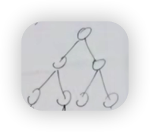

## 树的理论基础

### 分类

-  满二叉树

  除了最后一层叶子节点外，其他层都有两个叶子节点

  

  

- 完全二叉树

  与满二叉树类似，最后一层叶子节点只要求连续，不要求占满

- 二叉搜索树

- 平衡二叉树

---

### 二叉树的遍历分类

- 深度优先
  - 前序
  - 中序
  - 后序
- 广度优先

深度优先通过递归或者非递归实现，其中非递归使用栈（stack，先进后出）数据结构实现；广度优先使用队列（queue，先进先出）数据结构实现

递归 => 栈模拟递归 => 队列 

---

### 前中后序分别是什么意思？

前序：中左右

中序：左中右

后序：左右中

这里的左右指的是左子树，非左节点

## 树的操作题目

- [普通树的深度优先遍历 - 递归版](https://github.com/wojiaofengzhongzhuifeng/pracise-code/blob/main/20-%E5%A4%9A%E5%8F%89%E6%A0%91-%E6%B7%B1%E5%BA%A6%E4%BC%98%E5%85%88%E9%81%8D%E5%8E%86-dfs.html)
- [普通树的深度优先遍历 - 非递归版 - 栈 stack：后进先出 - array.pop实现](https://github.com/wojiaofengzhongzhuifeng/pracise-code/blob/main/30-%E5%A4%9A%E5%8F%89%E6%A0%91-%E6%B7%B1%E5%BA%A6%E4%BC%98%E5%85%88%E9%81%8D%E5%8E%86-%E9%9D%9E%E9%80%92%E5%BD%92.html)
- [普通树的广度优先遍历 - 队列 queue ：先进先出 - array.shift实现](https://github.com/wojiaofengzhongzhuifeng/pracise-code/blob/main/21-%E5%A4%9A%E5%8F%89%E6%A0%91-%E5%B9%BF%E5%BA%A6%E4%BC%98%E5%85%88%E9%81%8D%E5%8E%86-bfs.html)
- [二叉树遍历-深度优先-递归版](https://github.com/wojiaofengzhongzhuifeng/pracise-code/blob/main/21-%E4%BA%8C%E5%8F%89%E6%A0%91-%E6%B7%B1%E5%BA%A6%E4%BC%98%E5%85%88%E9%81%8D%E5%8E%86-%E9%80%92%E5%BD%92-dfs.html)
  - 前序遍历
  - 中序遍历 
  - 后序遍历
- 二叉树遍历-深度优先-非递归版
  - [前序遍历](https://github.com/wojiaofengzhongzhuifeng/pracise-code/blob/main/31-%E4%BA%8C%E5%8F%89%E6%A0%91-%E6%B7%B1%E5%BA%A6%E4%BC%98%E5%85%88%E9%81%8D%E5%8E%86-%E5%89%8D%E5%BA%8F-%E9%9D%9E%E9%80%92%E5%BD%92.html)
  - [中序遍历](https://github.com/wojiaofengzhongzhuifeng/pracise-code/blob/main/32-%E4%BA%8C%E5%8F%89%E6%A0%91-%E6%B7%B1%E5%BA%A6%E4%BC%98%E5%85%88%E9%81%8D%E5%8E%86-%E4%B8%AD%E5%BA%8F-%E9%9D%9E%E9%80%92%E5%BD%92.html)
  - 后序遍历，与前序一致，在最后reverse即可？
- 二叉树遍历-广度优先
- 【todo】根据中序 + 后序结果还原二叉树

## 遍历理解

- 深度有递归 + 非递归版；广度只有非递归版
- 广度优先遍历不存在前中后序遍历？
- 一般把广度遍历称为层次遍历
- 「深度优先-非递归版」与「广度优先」除了数据结构不一致，其他逻辑都是一样的