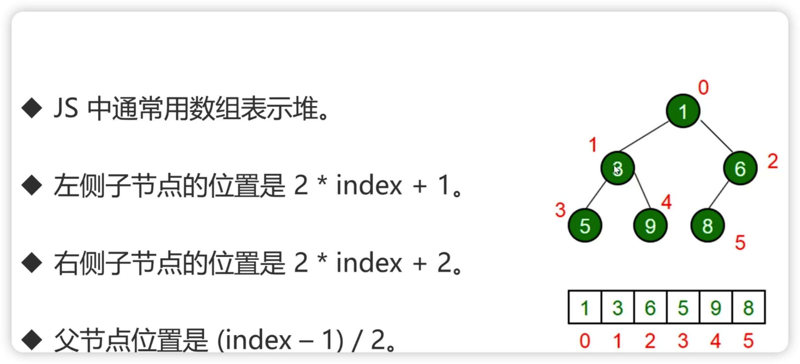

### 堆的特点

- 是一种特殊的完全二叉树

- 用于找到第K 个最大最小数字

- 父节点都大于或者小于子节点

- 可以直接使用数组表示堆，使用广度遍历保存数据

  

---

### 实现堆

[代码](https://github.com/wojiaofengzhongzhuifeng/pracise-code/blob/main/47-%E6%89%BE%E5%87%BA%E4%B9%B1%E5%BA%8F%E6%95%B0%E7%BB%84%E4%B8%AD%E7%AC%ACK%E5%A4%A7%E7%9A%84%E5%85%83%E7%B4%A0.html)

核心逻辑：

1. js 使用数据实现堆
2. 往堆中插入新数据，需要插入到堆的最后，然后让这个新数据**上移**到合适位置
3. 删除堆数据，一般指的是删除堆顶，删除堆顶与删除数组不同，删除堆顶的步骤为：
   1. 将堆顶的值设置为堆底的值，并且将堆底节点从数组中弹出
   2. 当前堆顶的值不符合堆的规则，因此要**下移**到合适为止