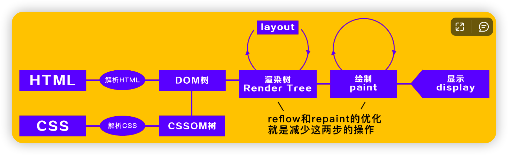

## DOM 事件机制

- 分为捕获=>目标=>冒泡三个阶段
- 目标阶段（即在目标元素上的事件）
  - 老浏览器：先绑定的先触发
  - 新浏览器：先触发捕获、再触发冒泡
- 同一个元素、同一个阶段，先绑定的先触发
- e.stopPropagation()实际上是阻止事件传播，包括冒泡和捕获。而不仅仅是阻止事件冒泡

## 输入 URL 过程

### 过程

- 输入URL
  - 内容缓存（强缓存）阶段
- DNS 解析
- TCP 三次握手
- 发送 HTTP 请求
  - 内容缓存（协商缓存）阶段
- 服务器处理请求并且返回HTTP响应
- 浏览器解析渲染页面

## 浏览器渲染

### 渲染过程

- chrome 审查元素 === DOM 树；
- 页面实际渲染 === 渲染树；

### script 的 async VS defer

- defer

  - 加载异步
  - 执行需要等待 dom 解析执行完成

- async

  加载异步，加载完成立即执行，可能打断dom渲染，不会等待 dom 解析

### 重绘 vs 重排

- 重绘

  元素样式属性（**除**形状、大小）发生改变了

- 重排

  DOM 增删或者修改元素形状 or 大小

- 重绘不一定导致重排，但重排一定会导致重绘

### 为什么css 放前面

防止重复修改修改渲染树

### 为什么script 放最后

- 假设完全加载网页需要1s，其中加载页面内容需要0.5s，加载script 需要0.5s
- 我们希望用户等待0.5s后，加载初始页面内容，抓住用户的注意力；而不是需要让等待1s

### DOM ContentLoaded  window.onload 区别是什么？

- 前者表示网页的资源全部加载完毕，包括图片、视频等
- 后者仅仅表示 DOM 加载完毕

### display:none vs visibility: hidden

visibilty: hidden 存在于DOM 树与渲染树

## 浏览器缓存

- 强缓存
  - expires 
  - Cache-Control
- 协商缓存
  - Last-Modified
  - ETag

## 存储

- cookie 可以通过 `domain = .google.com` ，那么 a.google.com 与 b.google.com 都可以共享cookie
- 每次发送请求，都会带上cookie
- sessionStorage 与tab 绑定，创建tab、关闭tab 都会操作 sessionStorage 
- 【todo】token cookie localstorage

## 页面通信

### 可以使用的方法

- websocket
- postMessage
- localStorage
- server worker 

### 域名不同，想要实现通信

- 现有三个页面：页面 A，页面 B，页面 B 内隐藏的 A 同域名的 iframe
- 页面 A 与 A iframe 可以通过 localStorage 通信
- 页面 B 与 A iframe 可以通过 postMessage 通信
- 达到页面 A 与页面 B 通信效果