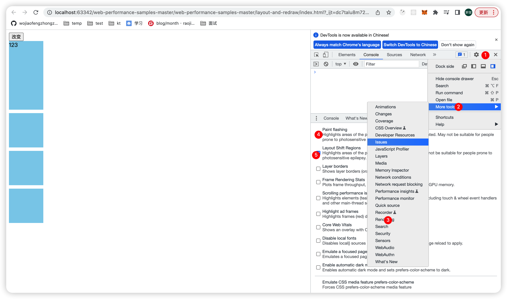

## DOM 事件机制

- 分为捕获=>目标=>冒泡三个阶段
- 目标阶段（即在目标元素上的事件）
  - 老浏览器：先绑定的先触发
  - 新浏览器：先触发捕获、再触发冒泡
- 同一个元素、同一个阶段，先绑定的先触发
- e.stopPropagation()实际上是阻止事件传播，包括冒泡和捕获。而不仅仅是阻止事件冒泡

## 输入 URL 过程

### 过程

- 输入URL
  - 内容缓存（强缓存）阶段
- DNS 解析
- TCP 三次握手
- 发送 HTTP 请求
  - 内容缓存（协商缓存）阶段
- 服务器处理请求并且返回HTTP响应
- 浏览器解析渲染页面

## 浏览器渲染

### 渲染过程

- chrome 审查元素 === DOM 树；
- 页面实际渲染 === 渲染树；

### script 的 async VS defer

- defer

  - 加载异步

  - 执行需要等待 dom 解析执行完成

  - 在 DOMContentLoaded 事件之前执行

  - 多个 defer script，下载script是并行的，但是执行script 是按照书写script 的顺序执行

  - 业务js使用defer？

    

- async

  - 加载异步
  - 加载完成立即执行，可能打断dom渲染，不会等待 dom 解析
  - 多个 async script，下载script是并行的，先下载的先执行（不保证执行顺序）
  - 第三方库使用async？

### 重绘 vs 重排

- 重排：重新排列，修改了元素的几何位置

- 重绘：重新绘制，元素重排或者元素的外观发生变化

- 重排一定导致重绘，因为修改了元素的几何位置，浏览器肯定要**重新绘制**，将修改结果显示到视图中

- 重绘不一定导致重排，因为假设只是修改了元素的颜色，当然不会修改元素的几何位置

- 如何检查页面是否重排？

  

- ~~重绘~~

  ~~元素样式属性（**除**形状、大小）发生改变了~~

- ~~重排~~

  ~~DOM 增删或者修改元素形状 or 大小~~

- ~~重绘不一定导致重排，但重排一定会导致重绘~~

### 为什么css 放前面

防止重复修改修改渲染树

### 为什么script 放最后

- 假设完全加载网页需要1s，其中加载页面内容需要0.5s，加载script 需要0.5s
- 我们希望用户等待0.5s后，加载初始页面内容，抓住用户的注意力；而不是需要让等待1s

### DOM ContentLoaded  window.onload 区别是什么？

- 前者表示网页的资源全部加载完毕，包括图片、视频等
- 后者仅仅表示 DOM 加载完毕

### display:none vs visibility: hidden

visibilty: hidden 存在于DOM 树与渲染树

## 浏览器缓存

### 缓存分类

- 强缓存
  - expires ：绝对时间，比如2022.12.20 14:00 ，可能有bug，尽量不用
  - Cache-Control：相对时间，比如 maxage=60s 表示60 s内使用原资源，优先使用
- 协商缓存
  - If-Modified-Since(请求头)/Last-Modified(响应头)：资源最终修改时间
  - If-None-Match(请求头)/ETag(响应头)
  - 实际使用中，响应头~~除了设置 Last-Modified or ETag ，还~~需要设置 Cache-Control:no-cache ，告知浏览器进行协商缓存，不设置 Cache-Control ，不会走协商缓存

### 缓存最佳实践

核心：尽可能复用缓存，一旦文件发生变化，又能及时更新

- html文件

  协商缓存，设置为 cache-control: no-cache

- 图片资源

  强制缓存，设置为 cache-control: max-age=86400

- js css 文件

  - 通过打包工具，产出样式文件名称为`style.51af74f.css`
  - 强制缓存，设置为 cache-control: max-age=一年秒数

## 存储

- cookie 可以通过 `domain = .google.com` ，那么 a.google.com 与 b.google.com 都可以共享cookie
- 每次发送请求，都会带上cookie
- sessionStorage 与tab 绑定，创建tab、关闭tab 都会操作 sessionStorage 
- 【todo】token cookie localstorage

## 页面通信

### 可以使用的方法

- websocket
- postMessage
- localStorage
- server worker 

### 域名不同，想要实现通信

- 现有三个页面：页面 A，页面 B，页面 B 内隐藏的 A 同域名的 iframe
- 页面 A 与 A iframe 可以通过 localStorage 通信
- 页面 B 与 A iframe 可以通过 postMessage 通信
- 达到页面 A 与页面 B 通信效果

## 浏览器如何解析 + 渲染 HTML ?

### 知识结构图

- 浏览器如何解析 + 渲染 HTML
  - 关键渲染路径
  - css js文件位置
  - 优化 css 文件加载
    - media 
    - rel属性
  - 优化 js 文件加载
    - rel 属性
    - async defer
  - 减少重排和重绘方法

