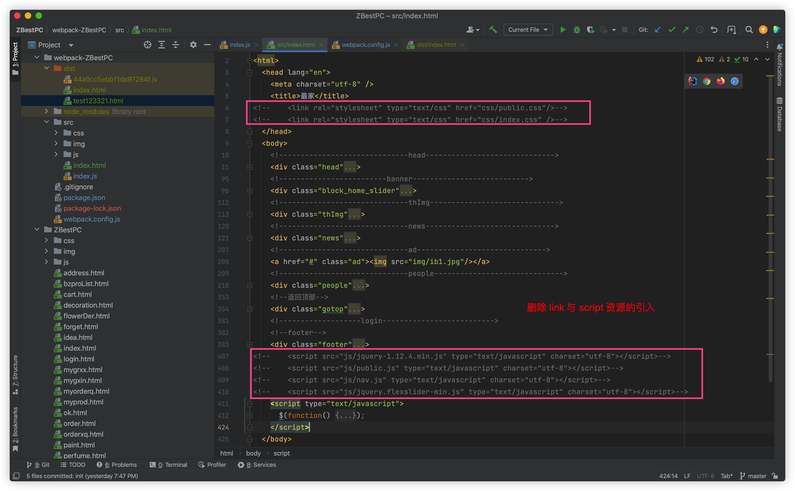
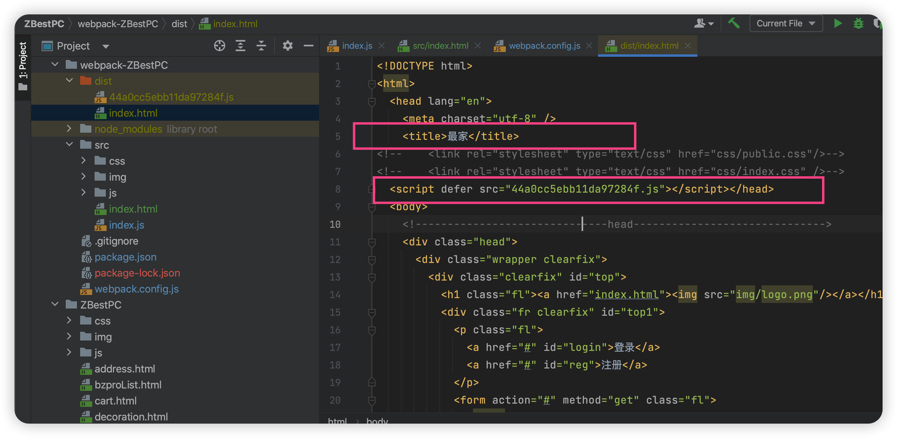
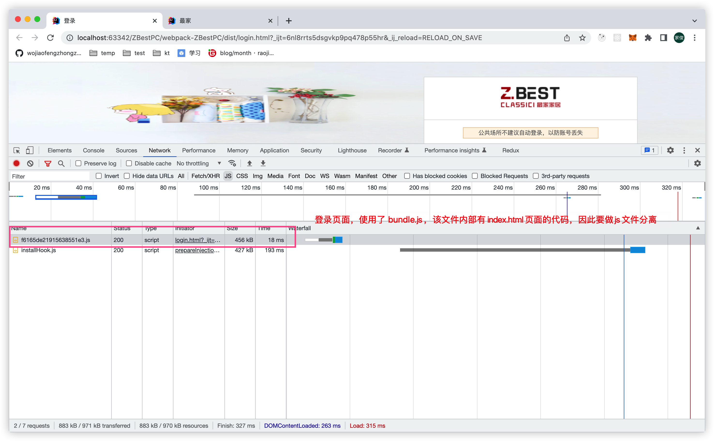
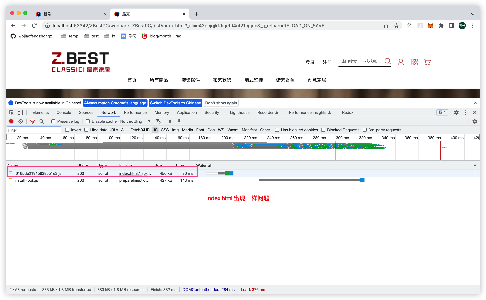
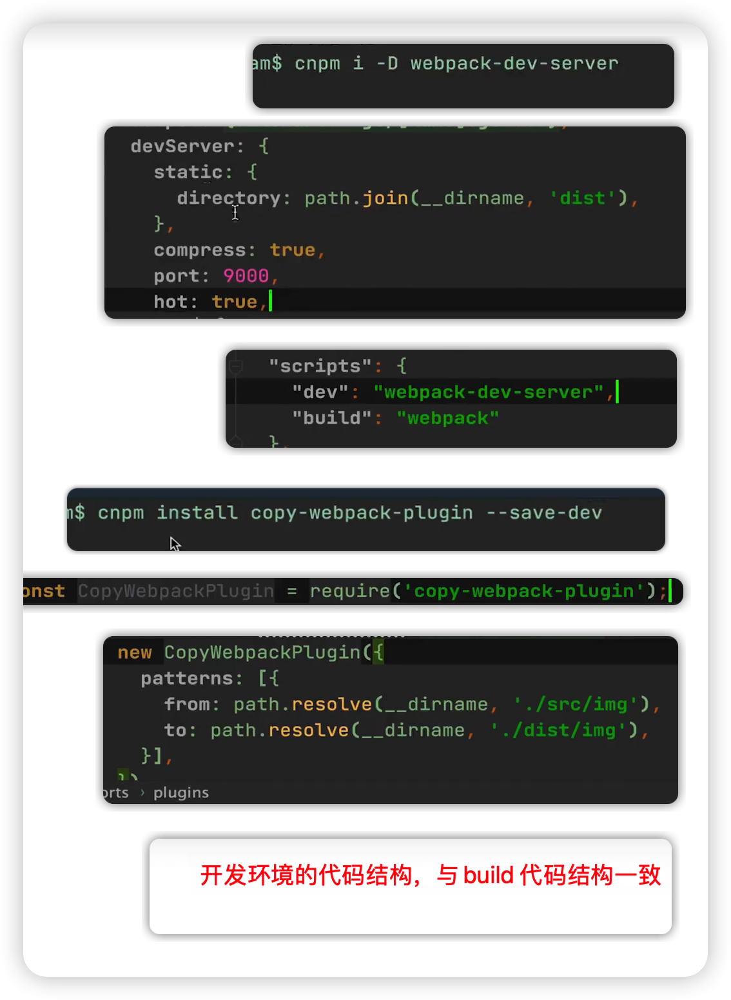
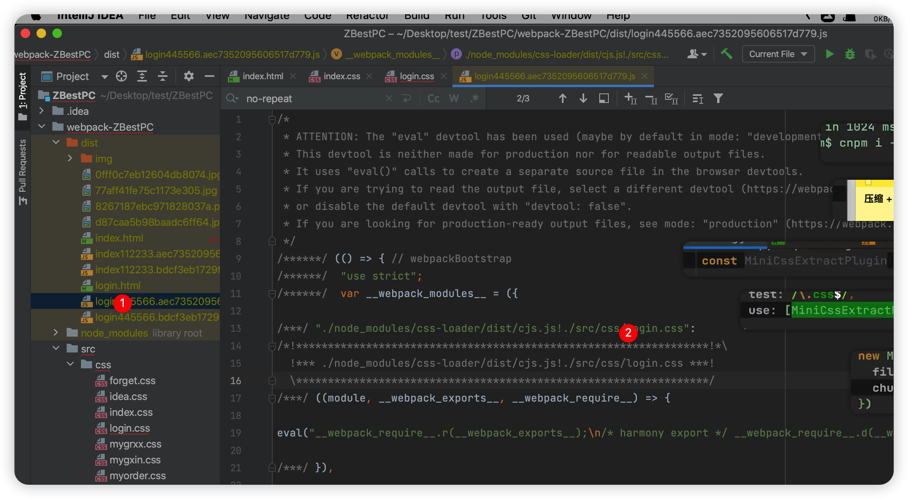
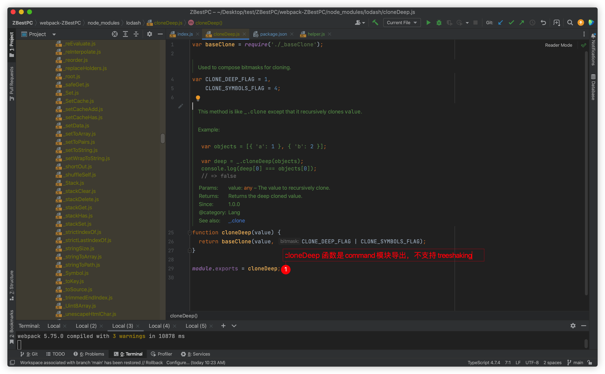
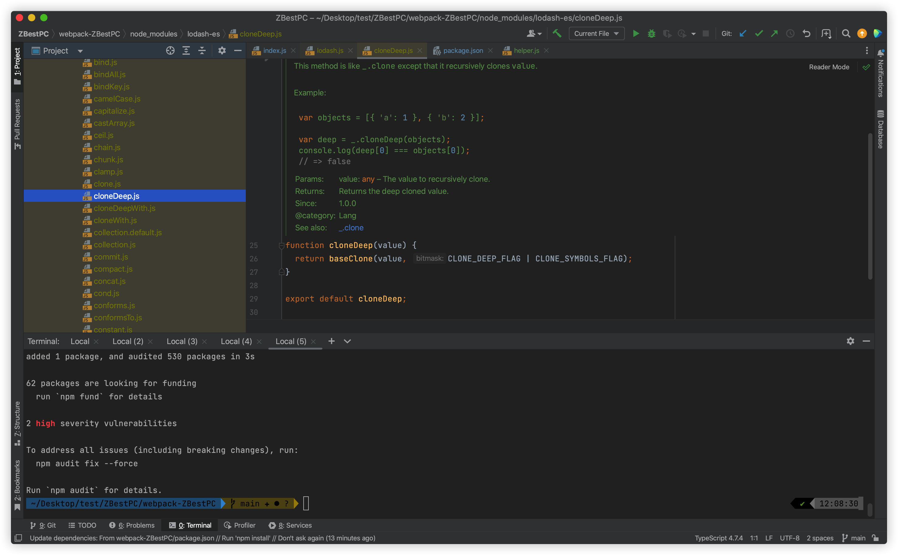

# 项目简介

该项目是一个使用原生js 、html、css 完成的下载站项目


# 项目存在问题


### 资源加载策略有问题

css 和 js 分散资源多，且资源采用同步加载，渲染时需要多次请求和加载，降低页面加载性能

### 代码未压缩

js 和css 代码未经过压缩

### 开发模式陈旧

需要同时维护html、js、css  


# 项目改造第一阶段：接入 webpack

## 项目初始化：将所有资源打到一个js 文件

- 创建 npm 项目

- 安装webpack 依赖

- 创建 js 入口文件

- 创建 + 编写 webpack 配置文件

  ```javascript
  module.exports = {
    entry: path.resolve(__dirname, './src/index.js'),
    output: {
      filename: 'bundle.js', 
    }
  }
  ```

- 注册 build 命令

- 检查打包产物 

- 资源文件(img、 js、 css、 index.html)拷贝

- 删除index.html的外部引用（link script）

  

  为什么要这样做？

  期待 script 与 link 的内容，合并成一个打包后的 script 文件（虽然这个script 的文件会很大，但是可以通过分包策略，优化，目前的目的是将多个分散资源合并成一个）

- 自动管理 html 与打包文件引用关系

  使用 html-webpack-plugin 插件，配置如下:

  ```javascript
  module.exports = {
    mode: 'development',
    entry: path.resolve(__dirname, './src/index.js'),
    output: {
      filename: '[hash].js',
    },
    // html-webpack-plugin 配置
    plugins: [new HtmlWebpackPlugin({
      template: path.resolve(__dirname, './src/index.html')
    })],
  }
  ```

  html-webpack-plugin 配置作用

  1. 告诉 webpack，复制  `./src/index.html`  文件到 `./dist/index.html`

  2. 在  `./src/index.html`  中，自动添加打包产物的引入，如上面的配置，会以 `'./src/index.js'` 作为js入口文件，打包生成的js 文件会被放 入到 `./dist/44a0cc5ebb11da97284f.js`，在 index.html 中，会添加这个的引入

     

- 在入口 js 中，引入所有 css 文件

  - 为什么 js 能处理 css ？步骤如下：

    - 读取css 文件内容

    - 将文件内容转化为 js 字符串

    - 使用 js api， 生成 style 标签，标签内部是 js 字符串，将标签插入到html中

  - webpack 配置如下

    ```javascript
    module: {
      rules: [
        {
          test: /\.css$/,
          use: ['style-loader', 'css-loader']
        }
      ]
    }
    ```

  - 在打包css 文件过程中，假设遇到图片资源引入，那么有两种处理图片的方法，其中webpack 4 使用外置的 url-loader 实现，webpack5 使用内置的 module.parse 实现

    - 如果图片较小，那么可以将图片作 base64 处理，放入到打包后的js中
    - 如果图片较大，那么可以将图片打包到 dist 目录，然后修改css 文件的引入路径

- 在入口js中，处理 js 引用 

  使用 webpack.ProvidePlugin 插件定义 jquery ，[代码commit](https://github.com/wojiaofengzhongzhuifeng/webpack-optimise-demo/commit/8efbe1404cee441fbe3c23238abff365a3986aa3)

  

## 项目性能优化

### 优化点1：js 分离

#### 问题说明

现有页面 index.html 和 login.html ，由于两者共用一个bundle.js 文件，那么我们需要将这个js文件分离为 index.js 与login.js 





#### 解决方法：声明多个入口js 文件

声明多个入口js 文件；在 HtmlWebpackPlugin 配置指定的打包 js 文件名称。[代码commit](https://github.com/wojiaofengzhongzhuifeng/webpack-optimise-demo/commit/0e304812a5aeabac8c2afb4d6bbf30a5b2e1426c)

#### 最终效果

减少无用 js 内容，其中login.html 减少 80%

---

### 优化点2：简化本地开发流程

#### 问题说明

在本地开发过程中，一旦修改了代码，那么必须手动执行 npm run build，才能生效，这样不方便开发

#### 解决方法：使用 webpack-dev-server

使用 webpack-dev-server plugin 简化本地开发流程。[代码commit](https://github.com/wojiaofengzhongzhuifeng/webpack-optimise-demo/commit/58153cd9c0659688a62d128f94e81ba47d5e6a4a)

#### 注意点1：使用 copy-webpack-plugin 解决图片404 问题

#### 注意点2：如何查看开发环境的项目结构？直接npm run build

 

---

### 优化点3：从bundle.js 分离 css

#### 问题说明

目前，打包后的js内部存在css 内容，我们可以将js 与css 内容分离



#### 解决方法：mini-css-extract-plugin 分离 js 中的 css 内容

[代码 commit](https://github.com/wojiaofengzhongzhuifeng/webpack-optimise-demo/commit/fb643c9f4e3252cf863a5f1905796882f9ad9820)

#### 最终效果

xxx

---

### 优化点4：压缩js 与css

#### 问题说明

打包后的js 与 css 文件，存在优化空间，可以通过删除空格压缩js 与css 文件大小

#### 解决方法：使用 uglifyjs-webpack-plugin 与css-minimizer-webpack-plugin 

[代码commit](https://github.com/wojiaofengzhongzhuifeng/webpack-optimise-demo/commit/16ab7eceb9587551f15f70d4ec1322cd9ae1c383)

#### 最终效果

css 文件减少 30% 大小

js 文件减少 5% 大小

---

### 优化点5：使用 treeshaking 减少打包 js 文件大小

#### 问题说明

由于不正确使用 treeshaking ，导致打包后的 js 文件很大

#### 使用 treeshaking ，需要确保的点：

1. 导出函数的时候（自己写的helper）

   不要使用 export default 导出多个函数

2. 引入lodash函数的时候

   1. 使用解构`{}`的语法引入lodash函数，可以 treeshaking

   2. 使用 `* as xxx` 语法可以treeshaking

      ```
      ✅ import {cloneDeep} from 'lodash-es'
      ✅ import * as _ from 'lodash-es'
      
      ❌不会treeshaking import _ from 'lodash-es'
      _.cloneDeep
      ```

3. 确保下载的外部库为 es module 语法

4. 确保mode = production

#### 注意点1：es 模块加载的方式有哪些？都有哪些特点？

1.  export 、  import 语法

   ```
   // helper.js
   export const a = 111111
   export function aa(){console.log("test11111")}
   
   import {a, aa} from './helper.js'  // 方式1 导出的并不是一个对象，虽然语法看上去好像导出一个对象
   import * as obj from './helper.js' // 方式2 这个可以 treeshaking！！！
   import obj from './helper.js'      // 方式3 这个不可以 treeshaking！！！
   ```

2. export default 、import 语法

   `export default`本质是输出一个叫做`default`的变量或方法

   不会treeshaking

   ```
   // helper.js
   const a = 111111
   function aa(){console.log("test11111")}
   export default {a, aa}
   
   
   import obj from './helper.js' 
   import * as obj from './helper.js' // 无法使用这种方式
   obj.aa() // 不会 treeshaking ，也就是说 111111 会在打包的结果，期待不在
   ```

#### 注意点2：【总结】如何正确使用 es module 导出自己写的函数？

假设有a b c 三个函数，不要通过 export default 导出这三个函数，否则 treeshaking 无效

```
function a(){}
function b(){}
function c(){}
export default {a, b, c}

import helperObj from './helper.js'
helperObj.a() 
```

#### 注意点3：lodash 与 lodash-es 有什么不同？

1. lodash 是 command 模块 、lodash-es 是 es 模块
2. 两者都可以通过 es 模块语法进行导入






---

### 优化点6：分离业务代码与库代码

#### 问题说明

目前所有的打包结果中，只有一个index.js，并且这个index.js 包含了库代码和业务代码，如果仅仅修改一小段业务代码，会打包生成新的index.js 造成浪费

#### 解决方法

使用 optimization.splitChunks 属性，将 index.js分割成 index + vendors + common 三个chunks

[代码commit](https://github.com/wojiaofengzhongzhuifeng/webpack-optimise-demo/commit/ebe3bfdaece53159247d868a176272a931f0d8be)


# 【todo】项目改造第二阶段：接入 React 框架


