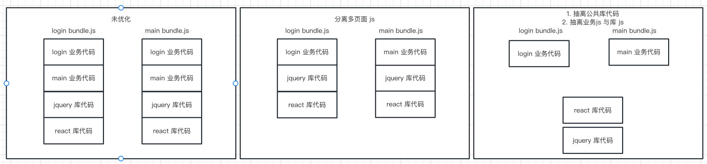

## 项目现状

本项目使用 PHP + jQuery + React 技术栈进行开发，并且项目存在以下问题

- 外部js库（jquery），是通过外部 CDN 获取，一旦外部 CDN 服务出现问题，影响网页正常使用
- 没有将业务 js 代码与库 js 代码做区分
- react 使用线上编译，严重影响性能

## 项目优化点 - 总结

- 优化项目的开发与打包
  - 通过 webpack，将源代码（jsx，css）打包为 bundle.js [commit](https://github.com/wojiaofengzhongzhuifeng/site-optimize-demo/commit/eb055ee534b5a27b92dcd9574f9bf2dc36ddeacb)
  - 通过 HtmlWebpackPlugin ，将 html 与打包后的js 文件自动引用，减少人工操作 [commit](https://github.com/wojiaofengzhongzhuifeng/site-optimize-demo/commit/791f7236d6db6b753e730943f95417650dd7b4c2)
  - 通过 webpack-dev-server，实现热更新 [commit](https://github.com/wojiaofengzhongzhuifeng/site-optimize-demo/commit/1322dfba7c2615e4a320cd531eda38ccd4f989c0)
- 多页面 js 优化 
  - 分离多页面 js [commit](https://github.com/wojiaofengzhongzhuifeng/site-optimize-demo/commit/10ebfbcca2edfadd032a6ecc9cb7acc328063489) 
  - 抽离公共库代码 + 分离业务 js 与库 js [commit](https://github.com/wojiaofengzhongzhuifeng/site-optimize-demo/commit/4d225b34de2dec27509d473bfaaf522bc2926475)

## 项目优化点 - 细节

### 通过 webpack，将源代码（jsx，css）打包为 bundle.js 

webpack在处理非 js 的文件需要相应的loader，通过配置的loader，将源代码的文件内容（包括js和css）全部打包到 bundle.js 中

### 多页面 js 优化

做了以下事情：

- 分离多页面 js

  设置多个 js 入口，将一个 bundle.js 拆分为 login.bundle.js 和 main.bundle.js ，拆分业务代码

- 抽离公共库代码 + 分离业务 js 与 库 js

