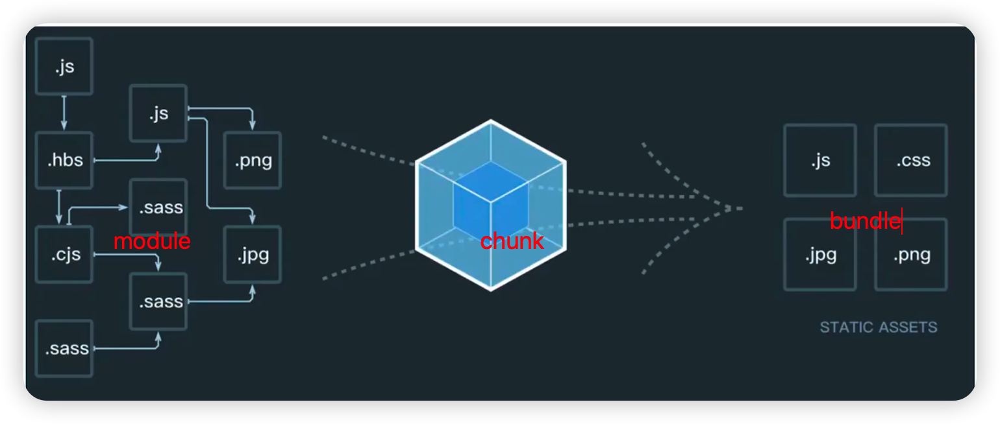

## webpack配置常见需求与问题

### 如何配置多入口

- entry 定义多个入口js 文件
- output 配置打包文件名称
- plugin 定义多个htmlWebpackPlugin

---

### 抽离 + 压缩 CSS 文件

- 抽离

  使用 mini-css-extract-plugin 

- 压缩

  使用 TerserJSPlugin 和 OptimizeCSSAssets

---

### 抽离公共代码

使用 optimization.splitChunks 属性，将 index.js分割成 index + vendors + common 三个chunks

[代码commit](https://github.com/wojiaofengzhongzhuifeng/webpack-optimise-demo/commit/ebe3bfdaece53159247d868a176272a931f0d8be)

---

### 如何实现懒加载？

使用import("./data.js").then(()=>{})即可

---

### module chunks bundle 分别是什么？

1. module === 原文件，又称模块

2. chunks 多模块的合成后的文件，生成的方式有 entry，import()，splitChunk 

3. bundle 最终输出的文件

---

