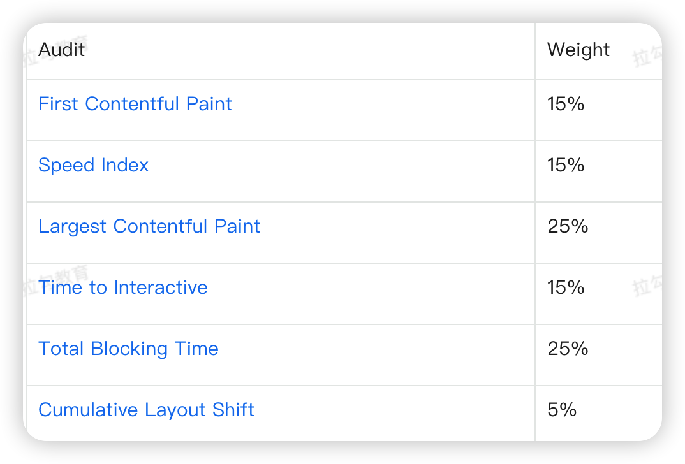
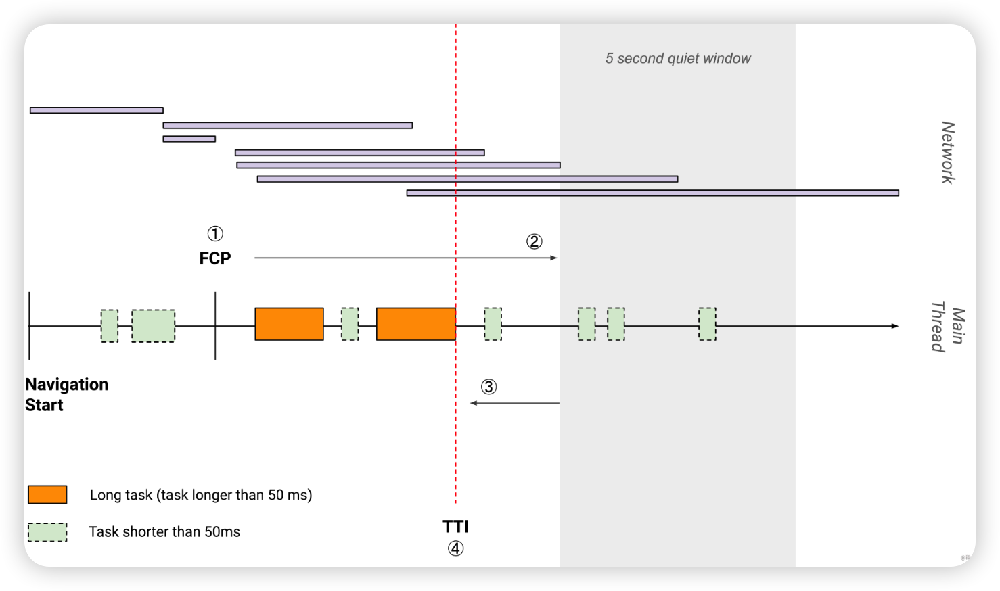
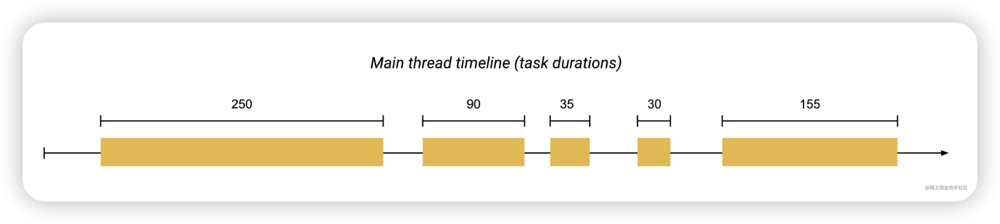
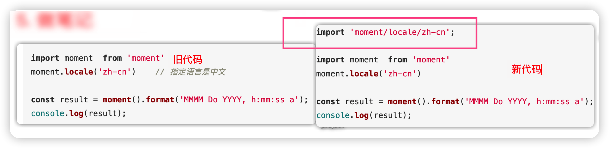
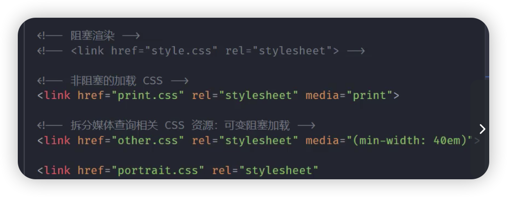
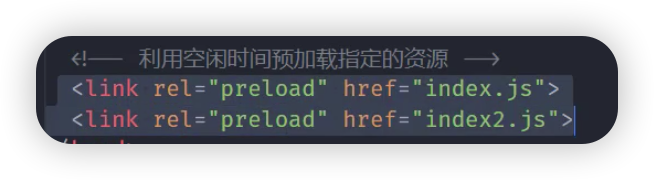
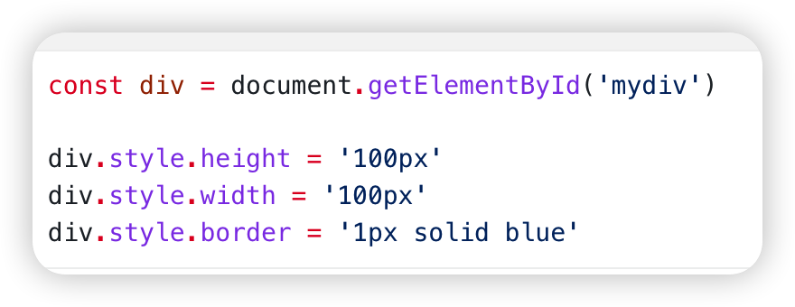
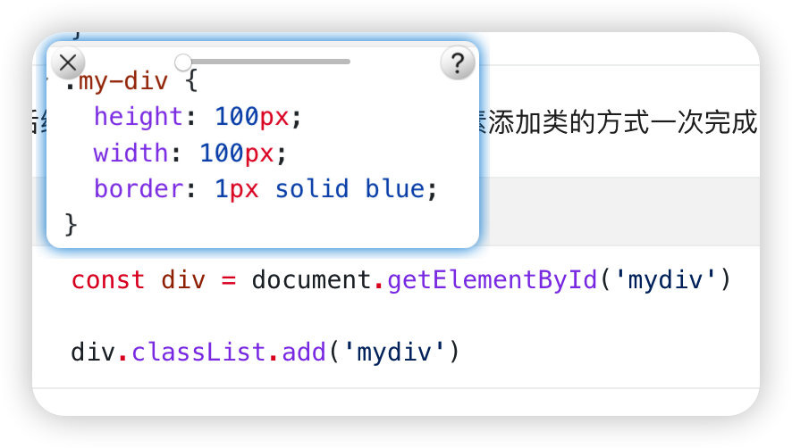

## 【todo】阅读这个博主的文章，有很多实际优化网站性能的方法

### 记录用户行为数据

### web-vitals npm 库可以记录性能指标

### 建立数据基线，选定关键指标、制定性能预算、以及设定目标值。

### 先埋点，得到网站各个页面的性能情况，优先处理性能较差的页面

https://juejin.cn/user/78820567681902/posts


## 从输入url 到页面渲染的流程

- 网络请求线程开启
  - URL 解析
  - 网络线程发起请求
  - ~~涉及强制缓存机制~~
- 建立HTTP 请求
  - DNS 解析
  - 通信链路的建立
  - ~~涉及协商缓存机制~~
- 前后台 HTTP 交互~~和涉及的缓存机制~~
- 浏览器接收到http响应信息后的关键渲染路径 (CRP，即浏览器如何渲染页面)


## 性能指标

### 各种性能指标分数占比

https://googlechrome.github.io/lighthouse/scorecalc/

- FCP 、 TTI 、 TBT 一组




### FCP(First Contenful Paint)

- 含义

  首次绘制DOM 内容的时间，可以理解为白屏时间 

### TTI (time to interactive)

- 含义

  可流畅地响应用户交互的时间。

- 理解

  - 从 FCP 开始

  - 找到第一个连续 5s 安静窗口（安静窗口指没有长任务且不超过两个 Get 请求）

  - 从安静窗口反推，找到最后一个长任务（长任务：耗时超过50ms）

  - 这个长任务结束的时间点就是 TTI

    

### TBT

- 含义

  总阻塞时长，指的是 FCP 与 TTI 之间主线程被阻塞长任务的总时长。

  单个长任务阻塞时间 = 长任务时间 - 50ms，TBT 为这些单个长任务阻塞时间的总和。

- 理解

  假设FCP 与TTI 之间的任务执行时间轴如下

  

  那么TBT = （250 - 50） + （90 - 50） + （155 - 50） = 345 ms

### LCP(Largest Contentful Paint)

- 含义

  可视区域最大内容呈现屏幕时间，可以理解为渲染主要内容所需时间

- 理解

  - 需要等网页完全加载完毕后，浏览器经过内容大小比对，比较得到最大内容呈现到屏幕的时间

### CLS

- 含义

  页面内容发生意外偏移

### Speed Index

- 含义

  衡量页面可视区域加载速度的指标

### ~~FID(First Input Delay)~~

- 含义

  首次可交互时间，可以理解为为了可交互，所需等待时间

- 理解

  - 已经呈现内容，但是不能可靠交互
  - 原因是主线程在执行耗时较长的任务


## 性能测试工具

- lighthouse 
- pagespeed
- 浏览器devtool
  - command + shift + p，搜索 coverage ，可以查看js 和css 文件使用率，指导打包优化
- web-vitals 包

## 传输优化

### 核心思路

- [更好的连接传输效率](2022年12月14日-性能优化.md#更好的连接传输效率)
- [合理的请求数量与资源大小](2022年12月14日-性能优化.md#合理的请求数量与资源大小)
- [合适的缓存](2022年12月14日-性能优化.md#合适的缓存)

## 更好的连接传输效率

### 减少 DNS 查找

- 减少 DNS 请求次数

- 进行 DNS 预获取

  ```
  <link rel="dns-prefetch" href="//g.alicdn.com">
  ```

### 使用新版本的HTTP协议

### 减少 HTTP 重定向

### 使用 CDN

## 合理的请求数量与资源大小

### 小图片产出为 base64 

### bundle 加hash

### 懒加载

vue react 路由懒加载

### 提取业务公共代码与第三方代码

使用 optimization.splitChunks 属性，将 index.js分割成 index + vendors + common 三个chunks

[代码commit](https://github.com/wojiaofengzhongzhuifeng/webpack-optimise-demo/commit/ebe3bfdaece53159247d868a176272a931f0d8be)

### ignorePlugin

- 作用

  排除第三方包指定目录，让这些目录不要被打包，如moment.js 中使用国际化，如果配置ignorePlugin，会将没有使用的语言都打包

- 新增 webpack 配置

  ```javascript
  new webpack.IgnorePlugin({
      resourceRegExp: /^./locale$/, // 具体忽略的目录为 locale
      contextRegExp: /moment$/, // 需要忽略 moment 这个库
  })
  ```

- js 代码变更

  

### 压缩传输的资源

客户端发送：accept-encoding 

服务端返回：content-encoding

### 使用 production

- 作用
  - 自动开启压缩
  - vue react 自动删除调试代码
  - 启动tree-shaking

### 使用 scope hosting

- 作用
  - 合并函数作用域
- 如何使用
  - 确保第三方库使用es6 语法
  - 使用内置插件：ModuleConcatenationPlugin

## 合适的缓存

### 使用强制缓存、协商缓存

## 运行时优化

### 【todo】：js css 文件阻塞情况

- **页面的html、css、js、图片等资源都已经加载完之后才会触发 load 事件**

- **DOM 树（即 DOM 对象存在于 js 环境中）已经构建完毕就会触发 DOMContentLoaded 事件**

- js 文件的作用

  - 可能修改 DOM 树
  - 可能修改 css 树
  - 可能不修改树

- 阻塞的内容是什么？

  - 阻塞DOM树的构建
  - 阻塞页面的渲染

- 阻塞情况

  |                 | js文件 | css文件 |
  | --------------- | ------ | ------- |
  | 阻塞DOM树的构建 | 是     | 否      |
  | 阻塞页面的渲染  | 否     | 是      |

- 为什么js 会阻塞 DOM 树的构建

  因为 js 文件可能会修改 DOM 树，因此需要下载js文件 + 执行js 文件，在此过程中，会停止DOM树的构建

- 为什么css 不会阻止DOM树的构建

  因为 css 不会修改 DOM 树

- 为什么js 不会阻塞页面的渲染

  现代浏览器为了更好的用户体验，遇到js 时，如果此时存在 DOM 树，会将当前的DOM树渲染到屏幕，减少白屏时间

- 为什么css 会阻塞页面渲染

  同样是为了更好的用户体验，如果和js 一样，将当前的DOM 树渲染到屏幕上，假设当前的css 文件对渲染树造成重排，会影响性能与用户体验

- 为什么 css 会阻塞后面js执行

  因为 js 可能修改 css 树，假设不阻塞的话，css 树一边生成，js 一边修改，就会乱

### 关键渲染路径

- 处理 HTML 并且**构建** DOM 树
- 处理 CSS 并且**构建** CSSOM 树
- 将 DOM 与 CSSOM 树**合并**成一个render tree
- 根据渲染树来布局，**计算**每个节点的几何信息
- 将节点**绘制**到屏幕上


###  优化措施

#### 优化 CSSOM

- 通过 link.media 属性，按条件加载关键 css 文件

  - CSS 会阻塞关键渲染路径

    

- 使用 link ，不使用 @import

  因为 link 可以并发下载；@import 只能串行下载

- 使用 link.rel=preload 属性，在空闲时间预加载文件

  

#### 优化 js 加载

- js 会阻塞 DOM 的构建，并且js 会被CSS 阻塞

- 最简单的情况，应该把script 放到 `</body>`之前，这样js 的加载和执行就不会阻塞 DOM 的构建，但是这样做，可以有优化空间，期待这样加载script：浏览器在解析html 的同时，下载 script 内容，如果script 内容不修改或者查询 dom，那么设置 async；如果script 修改或者查询 dom ，设置 defer？

- 使用 link.rel=preload 属性，在空闲时间预加载文件

  

#### 优化 js 执行

- 使用css 做动画，非js，如果一定要使用 js 做动画，使用 requestAnimationFrame ，非定时器
- 使用webworker执行 js 同步耗时操作
  - 由于 js 是单线程执行，所有同步任务都在一个线程执行，并且样式计算、页面布局也在同一个线程运行，因此可以把**纯计算**的任务，下放到 webworker 执行，保证线程不因为耗时操作，影响ui 绘制
- 节流和防抖
- [虚拟列表](https://codesandbox.io/s/youthful-greider-52o3z2)

### 计算样式优化

### 重排和重绘优化

- 哪些可以触发重排和重绘操作

  - 对 DOM 的几何属性进行修改，包括 width、height、padding、left、top
  - 更改 DOM 的结构
  - 获取特定属性，如offsetWidth、offsetHeight、offsetTop、offsetLeft、scrollTop、scrollLeft、scrollWidth、scrollHeight、clientTop、clientWidth、clientHeight、document.getComputedStyle()

- 批量修改DOM ，避免多次重排

  - 通过类名，修改多个属性

    - 不好的设置

      

    - 好的设置

      

  - 避免多次读取 DOM 属性，应该使用变量缓存获取的DOM 值


## 打包速度优化

目的是加快开发速度，不直接对页面产生性能优化正向作用

### 优化 babel-loader

- 添加缓存
- 明确范围

```javascript
export default {
    // ...
    module: {
        rules: [{
            // ...
            test: /\.js$/,
            exclude: /node_modules/, // 明确排除范围
            include: /src/, // 明确作用范围
            use: [{
                loader: "babel-loader",
                options: { cacheDirectory: true } // 添加缓存
            }]
        }]
    },
};

```


### ~~noParse~~

### happyPack

- 通过多进程打包

### ParllelUglifyPlugin

- 通过多进程压缩js

### 热更新

### DllPlugin 
