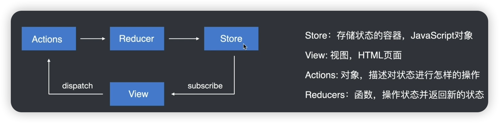
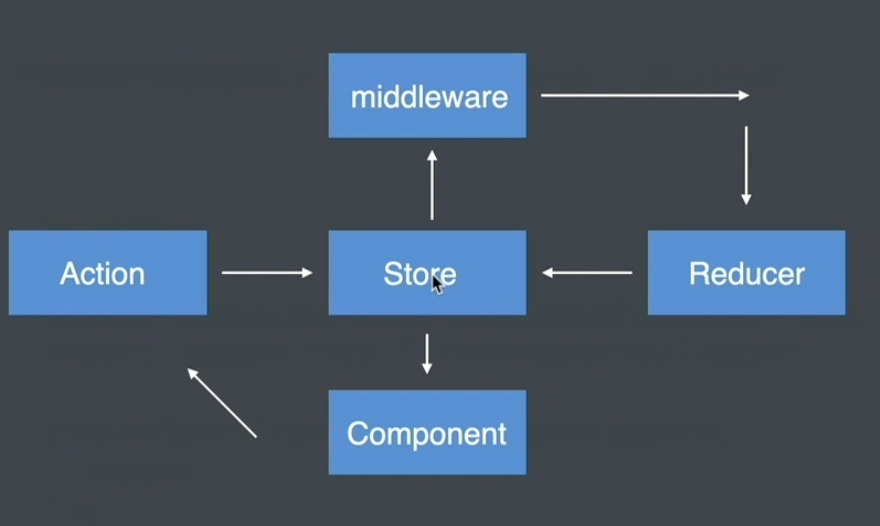
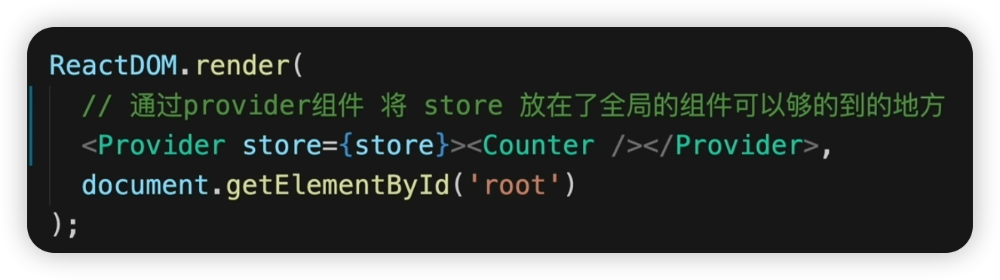
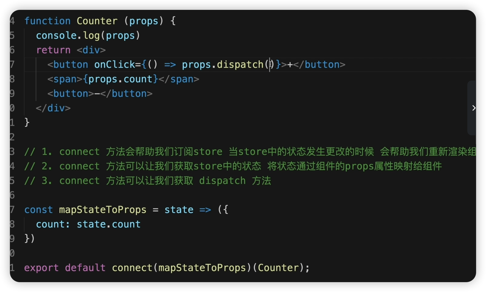
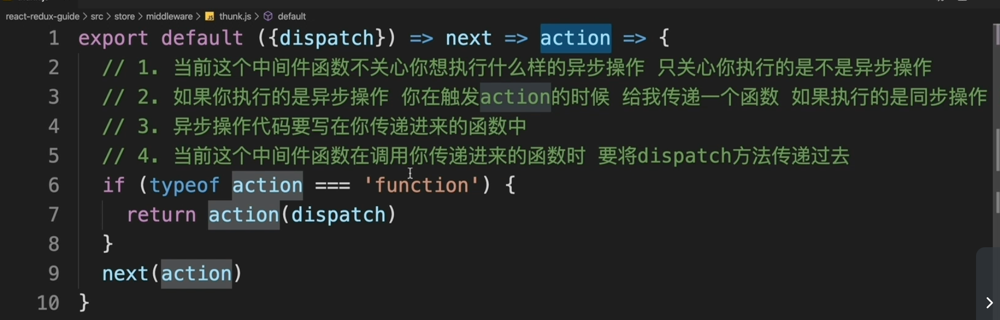
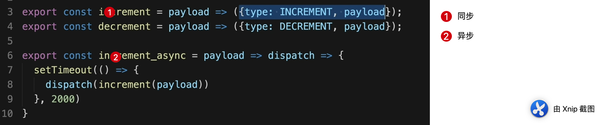

## 直播

### redux 核心概念

### react-redux 提供哪些api 作用分别是什么？

- Provider 组件：在根组件使用，这样整个应用都可以通过 connect 得到 store 的数据

  

- connect 高阶函数

  

### redux 与 mobx 的区别是什么？

- 核心区别是：状态与视图如何发生关联

  前者通过 disptach api 触发视图更新；后者通过响应式触发视图更新

- redux 是函数式；mobx 是响应式 

### 数据管理的核心问题

- 如何做同步、异步数据修改
- 数据修改后，如何进行视图更新

### redux 异步解决方案

- 定义异步中间件 rao-thunk 

  9 行是同步逻辑

  6 ~ 8 行是异步逻辑，意思是如果发现action是一个**函数**（如果是同步，应该是一个对象），那么这个中间件会将dispatch 接口抛出去，由使用方控制派发action

  

- 使用异步中间件

  

### redux-thunk 中间件

上面的 rao-thunk 就是redux-thunk 的实现

### redux-saga 中间件

redux-saga 可以将异步操作从action creator 文件中抽离出来，放在一个单独的文件中

### redux-actions 中间件

redux 流程中大量的样板代码读写很痛苦，使用redux-actions 可以简化action 和reducer 的处理

### 使用redux 及其周边库

- 安装库

  `npm install react-redux redux redux-actions redux-saga`

- 定义 store

  - 定义rootReducer
  - 定义rootSaga
  - 应用saga 中间件

  

### redux-toolkit 使用切片代替

### 使用 redux-toolkit 

- 安装

  `npm install @reduxjs/toolkit react-redux`

