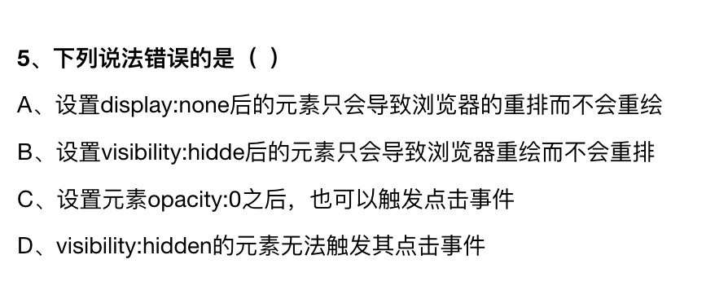

## 2023.02.02 gate

### 看什么书

### 最近在看新技术是什么

### 请求封装

### 如何重构下载站的

### webpack 基础配置

### rollup 打包

### 脚手架作用

### react渲染过程

### react 父组件重新渲染，但是不希望子组件重新渲染，如何实现

## 2023.02.02 软牛

### visibiel

### 自适应布局

### 类型别名和接口

## 2023.02.03 美图

### 自动化测试过程

### markdown 编辑器演示

## 第一周面试总结

这周面试了3家公司，应该都没有通过第一轮，从录屏展示的问题是：

- 项目做了什么说不清楚
- markdown 编辑器没有预览链接 =>
- 基本很少问到前端基础知识的问题，但是一旦涉及到前端的问题，都是react 这类框架的问题，由于之前较少关注这些，所以导致回答的一般般

感悟是：

- 之前的大部分文章都可以作废了，因为都是拾人牙慧，没有自己的知识理解

- 尝试录屏讲清楚自己的做的事情

  

## 2023.02.07 illa 

### 反转链表

还是需要背才知道

### 反转指定区间链表

### react 实现原理

### 为什么 hooks 不能在for循环使用

### 什么会造成组件re reder 和优化方法

### 闭包在react 的应用

### 虚拟dom的价值

### 说明markdwon 编辑器

## 2023.02.10 直客通

### useState 是同步还是异步

### redux vs mobx 

