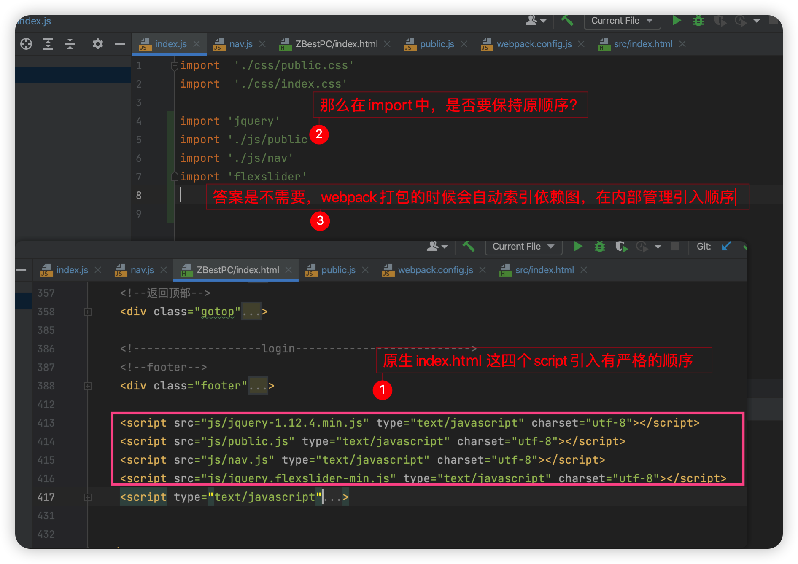
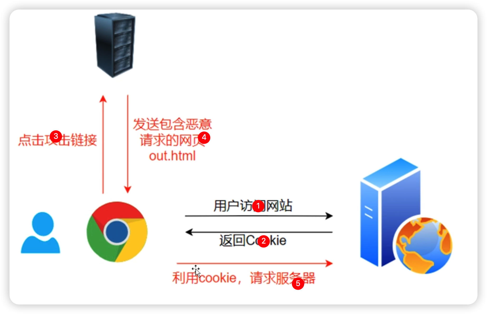

## HTML

### 如何理解 HTML 语义化

---

### 哪些HTML标签是块级元素，哪些是内联元素

## CSS

### 盒子模型的宽度如何计算

---

### margin 纵向重叠问题

---

### margin负值问题

---

### BFC理解与应用

- 定义

  块级格式上下文：一块独立的渲染区域，内部元素的渲染不会影响外部元素的渲染

- 作用
  - [清除浮动](https://codesandbox.io/s/busy-feather-c46ihv?file=/index.html)
  - [阻止margin重叠](https://codesandbox.io/s/crazy-waterfall-sfhzoc?file=/index.html)
- 生成BFC 的条件
  - HTML 元素
  - position === absolute or fixed
  - display === flex or inline-block
  - float !== none
  - overflow !== visible

---

### flex 

- display: flex
- 水平的叫主轴，垂直的叫交叉轴
- 容器属性
  - `flex-direction`属性决定主轴的方向（即项目的排列方向）
  - `flex-wrap`属性定义，如果一条轴线排不下，如何换行。
  - `justify-content`属性定义了项目在主轴上的对齐方式
  - `align-items`属性定义项目在交叉轴上如何对齐
  - `align-content`属性定义了多根轴线的对齐方式。如果项目只有一根轴线，该属性不起作用。
- item属性
  - `flex`属性是`flex-grow`, `flex-shrink` 和 `flex-basis`的简写

---

### absolute 和relative 分别依据什么定位

---

### 居中对齐方式

---

### line-height 继承问题

---

### rem 是什么

---

### @import vs link 区别？

不建议使用@import，因为@import 是串行，link 是并行

---

## JS 

### typeof 能判断哪些类型

---

### 手写深拷贝

---

### 如何判断一个变量是否为数组

---

### 描述event loop 机制

---

### 什么是宏任务、微任务、有什么区别

## 框架

### 常见的hooks

- [useRef](https://codesandbox.io/s/hidden-snow-wnu83j)
  - 保存dom 
  - 外部库创建的实例
- useMemo
  - 
- useCallback
- useReducer

### react hooks有什么坑？

- 不要改变多个 hooks 的调用顺序
- [指定 useEffect 的依赖项，避免得到旧值](https://codesandbox.io/s/bitter-cloud-wuqcl6?file=/src/App.tsx)
- [只会执行一次 useState 初始化值操作](https://codesandbox.io/s/ecstatic-sara-jhsfem?file=/src/App.tsx)
- useEffect 的依赖项不能是引用类型

## webpack

### 如何抽离css 文件

---

### 分离业务公共代码

-  

---

### 分离业务代码与库代码

---

## 浏览器 + 网络

### 进程和线程

- 简单类比
  - 浏览器 === 集团
  - 进程 === 部门
  - 线程 === 员工

- 浏览器主要进程

  - Browser进程

    浏览器的主进程（负责协调、主控），只有一个。作用有

    - 负责浏览器界面显示，与用户交互。如前进，后退等
    - 负责各个页面的管理，创建和销毁其他进程
    - 将Renderer进程得到的内存中的Bitmap，绘制到用户界面上
    - 网络资源的管理，下载等

  - **GPU进程**：最多一个，用于3D绘制等

  - **浏览器渲染进程**（浏览器内核）（Renderer进程，内部是多线程的）：默认每个Tab页面一个进程（有时候会优化，如多个空白tab会合并成一个进程），互不影响。主要作用为 控制页面渲染，脚本执行，事件处理 等

- 浏览器渲染进程的线程组成
  - GUI渲染线程
    - 负责渲染浏览器界面，解析HTML，CSS，构建DOM树和RenderObject树，布局和绘制等。
    - 当界面需要重绘（Repaint）或由于某种操作引发回流(reflow)时，该线程就会执行
    - 注意，**GUI渲染线程与JS引擎线程是互斥的**，当JS引擎执行时GUI线程会被挂起（相当于被冻结了），GUI更新会被保存在一个队列中**等到JS引擎空闲时**立即被执行。
  - JS引擎线程
    - 也称为JS内核，负责处理Javascript脚本程序。（例如V8引擎）
    - JS引擎线程负责解析Javascript脚本，运行代码。
    - JS引擎一直等待着任务队列中任务的到来，然后加以处理，一个Tab页（renderer进程）中无论什么时候都只有一个JS线程在运行JS程序
    - 同样注意，**GUI渲染线程与JS引擎线程是互斥的**，所以如果JS执行的时间过长，这样就会造成页面的渲染不连贯，导致页面渲染加载阻塞。
  - 事件触发线程
    - 归属于浏览器而不是JS引擎，用来控制事件循环（可以理解，JS引擎自己都忙不过来，需要浏览器另开线程协助）
    - 当JS引擎执行代码块如setTimeOut时（也可来自浏览器内核的其他线程,如鼠标点击、AJAX异步请求等），会将对应任务添加到事件线程中
    - 当对应的事件符合触发条件被触发时，该线程会把事件添加到待处理队列的队尾，等待JS引擎的处理
    - 注意，由于JS的单线程关系，所以这些待处理队列中的事件都得排队等待JS引擎处理（当JS引擎空闲时才会去执行）
  - 定时触发器线程
    - 传说中的`setInterval`与`setTimeout`所在线程
    - 浏览器定时计数器并不是由JavaScript引擎计数的,（因为JavaScript引擎是单线程的, 如果处于阻塞线程状态就会影响记计时的准确）
    - 因此通过单独线程来计时并触发定时（计时完毕后，添加到事件队列中，等待JS引擎空闲后执行）
    - 注意，W3C在HTML标准中规定，规定要求setTimeout中低于4ms的时间间隔算为4ms。
  - 异步http请求线程
    - 在XMLHttpRequest在连接后是通过浏览器新开一个线程请求
    - 将检测到状态变更时，如果设置有回调函数，异步线程就**产生状态变更事件**，将这个回调再放入事件队列中。再由JavaScript引擎执行。

---

### TCP/IP VS HTTP

TCP/IP 属于传输层；HTTP 属于应用层

---

## 性能优化

## 前端工程化

### 为什么使用 webpack 打包的jquery 源码文件，会出现 `Uncaught ReferenceError: $ is not defined` 错误？

---

### 使用 import 语法，是否需要关注引入的顺序？

## web 安全

### xss 

- 核心流程

  用户在目标网站，**执行**黑客植入的恶意代码

- 分类
  - 反射型
    - 假设目标网站没有对搜索输入框进行过滤操作
    - 黑客生成如下链接：`https://www.baidu.com?query=alert("test")`，然后发送给用户（alert 可以换成其他恶意代码）
    - 用户点击黑客生成链接，发现执行了alert 脚本，说明可以执行恶意代码
  - 存储型
    - 假设目标网站没有对用户输入的内容过滤，就直接保存到数据库
    - 黑客在某个文章的评论区，输入alert('test')，目标网站直接保存 alert('test') 内容
    - 其他用户访问这个文章网页，都会被执行 alert('test')，说明可以执行恶意代码
  - DOM 型
    - 假设目标网站尝试截取 `https://www.baidu.com#1`  的 1 内容作为网站的innerHTML
    - 黑客通过阅读网页源码，确定读取内容用途，并且注入恶意代码
- 解决方法
  - 对输入内容做过滤操作
  - 尽量不使用innerHTML

---

### csrf 

- 核心流程

  黑客冒充用户，执行敏感任务

  

- 解决方法
  - 方法1： 在后端验证refer
  - 方法2：Anti CSRF Token
    - 正常网站生成调用 token，通过xxx 发送给用户，并且将token保存到服务器
    - 每次调用敏感操作，正常网站都要验证token 的有效性