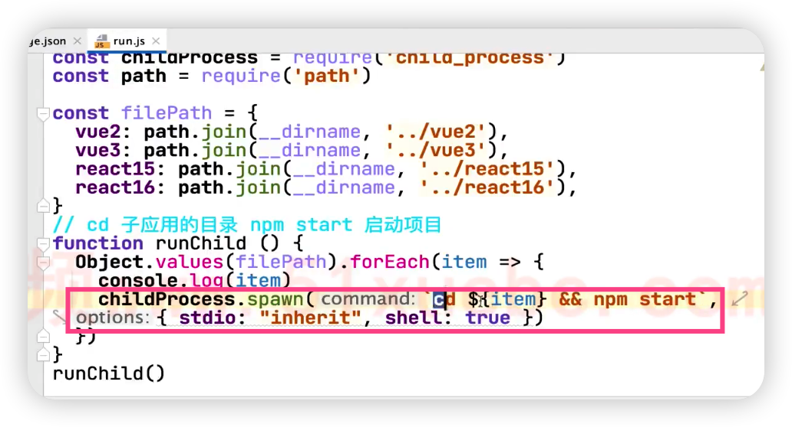

- 4-7 02:00 开始

- 自动启动所有子应用脚本

  通过子进程 `childProcess.spawn` 执行 shell 命令

  

- 子应用如何处理，才能让主应用控制？

  -  在打包工具中，通过 output.library 配置子应用的实例，这样在主应用中，可以通过 window.vue2 ,window.vue3, window,react15, window.react16 读取子应用的数据

    

  - 在子应用的入口js 文件，导出各种子应用的生命周期函数，被主应用调用

    

- 微前端框架

  - 子应用注册

  - 路由拦截

    

     

  -  

---

